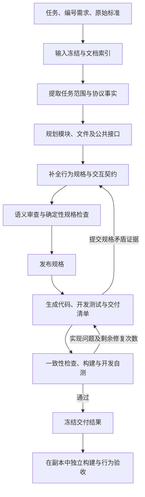

# SpecForge 项目说明

SpecForge 接收应用层网络协议的原始标准、任务说明和编号需求，通过范围提取、结构规划、行为规格、语义审查、代码生成和开发验证，生成多文件 Linux C99 项目。系统使用结构化规格连接各阶段，并以确定性检查的结果控制阶段推进。

目前的实验对象包括 MQTT 3.1.1 TCP broker、CoAP UDP server、HTTP/1.1 origin server 和 SMTP 本地邮件捕获 server 的指定功能子集。下文介绍系统的实际流程、交付内容及四轮四协议实验，其中实验四为项目整理后的最新一轮。

## 1. 输入、输出与工作流程

### 1.1 输入

| 输入 | 内容与作用 |
|---|---|
| 任务说明 | 指定实现角色、目标语言与平台、交付内容、启动方式及工程要求 |
| 编号需求 | 指定协议功能子集、应用行为、错误处理、数值上限和排除功能 |
| 原始协议标准 | 提供报文格式、状态、交互、错误处理和生命周期的规则依据 |

标准输入支持具有可提取文本的 PDF 和 UTF-8 文本。PDF 按提取页组织，文本按每 200 行分块；索引记录块编号、行数和内容哈希。模型通过目录、字面搜索和分段读取查找原文。当前文档处理不包含 OCR 或语义检索数据库。

一个任务接收一份标准输入；HTTP 案例将两份 RFC 原文合并为同一输入。需求使用带编号的条目，后续规格和测试清单沿用这些编号。

### 1.2 阶段及交接

| 阶段 | 工作内容 | 交接内容及检查 |
|---|---|---|
| 输入准备 | 保存输入并建立文档索引，无模型调用 | 检查输入格式、可提取文本及基础工具 |
| 事实提取 | 区分任务选择与标准规则，提取任务范围和协议事实 | 检查结构、需求编号覆盖、依据位置及未决问题 |
| 结构设计 | 划分模块和文件，定义公共类型与接口 | 检查归属、依赖、公开符号及公共接口的编译一致性 |
| 行为规格 | 描述算法、事件处理、报文映射、状态、错误及资源契约 | 检查函数覆盖、引用、跨文件调用、接口及溯源关系 |
| 语义审查 | 根据范围与事实重新推导行为，核对算法、交互和测试向量，修订规格 | 检查规格一致性及逐需求审查记录 |
| 实现与开发验证 | 编写源码、构建配置、项目使用说明、开发测试与交付清单 | 检查交付一致性，执行普通构建、自测和 sanitizer 构建、自测，最后恢复普通交付构建 |
| 独立验收 | 在交付副本中重新构建并执行固定协议套件，无模型调用 | 检查两种构建及必需场景的执行结果，并核对原交付内容未变 |

单项目内部按固定次序协作。事实、规划与审查、编码三类角色使用同一模型配置；结构设计、行为规格和审查分别启动任务与上下文。四协议并行由实验编排执行。

独立行为验收不参与生成反馈。生成期间的修复使用编译、开发自测、sanitizer 和交付一致性诊断；独立验收开始后，该次生成被冻结。

### 1.3 输出

完成生成的项目包含多文件 C 源码、公共头文件、构建配置、项目使用说明、开发测试及测试数据、交付清单和可执行文件。规格、原始输入、阶段记录和验收报告作为生成过程记录单独保存。

项目的模块划分、接口粒度、私有辅助函数和事件处理方案由模型生成。四个协议使用同一套生成流程和规格结构，控制器不按协议选择预制服务器实现。

## 2. 结构化规格与约束传递

### 2.1 三层中间表示

| 层次 | 表达的信息 |
|---|---|
| 模块层 | 模块职责、文件归属、模块依赖与生成顺序 |
| 文件层 | 源文件与头文件、公开类型和符号、依赖、计划接口及文件级测试向量 |
| 函数层 | 签名、依赖、算法或事件处理、输入输出、状态与错误、报文映射、调用契约及测试向量 |

规划阶段同时生成实际 C 公共头文件。函数规格中的签名、文件规格中的声明和公共头文件通过编译器探针交叉检查；检查还涵盖公开结构成员、枚举值、回调类型、类型别名和组合包含关系。

算法、状态变化、结果含义和资源义务包含受结构约束的自然语言描述；测试向量的输入与期望由模型生成。确定性检查覆盖结构、引用与接口编译一致性，协议行为另由语义审查和执行测试检查。

### 2.2 调用、报文与资源契约

规格描述报文字段与编码的对应关系，区分字段值、编码长度、完整报文长度和已消费字节数。跨文件调用记录参数、返回值含义、成功与失败条件，以及资源借用、转移和释放责任。

语义审查同时检查调用者与被调用者，核对返回结果、游标变化、错误处理和清理动作。涉及多个参与者的交互还检查事件就绪条件、描述符模式和被动接收方的输出行为。

公开调用契约的存在及签名一致性由机器检查；返回单位、资源责任、算法步骤和错误政策由模型审查及运行测试检查。

### 2.3 需求溯源

每条需求关联协议事实、规格位置和规划测试向量。任务指定的资源、数值上限及实现选择与标准事实分别记录。

检查器核对需求集合、引用位置、事实编号和向量位置。开发测试清单须覆盖每条已批准需求，并引用已存在的规格向量。此类检查核对编号与关联结构，不自动证明原文蕴含所提取事实，也不证明测试断言覆盖需求的全部条件。

## 3. 阶段控制、审查与修复

### 3.1 范围提取与规格发布

范围提取要求事实指向原始文档块和行区间，保留需求编号与来源位置，并在进入后续阶段前处理范围内未决问题。检查器核对依据位置存在、引用文本非空和编号对应关系。

规格发布前检查文件与符号归属、函数覆盖、跨文件契约、公共头文件及溯源关系。发布内容包括规格索引、运行约定和内容哈希。

编码阶段读取已发布规格的只读视图，公共头文件也被固定。源码、私有辅助函数、构建配置和开发测试由编码角色编写。编码角色不直接访问原始标准、人工协议样本或独立验收套件。

### 3.2 语义审查

规格作者完成后，系统启动独立的审查任务上下文，重新核对已批准范围与协议事实，按保存的算法推导报文及交互结果，并检查测试向量。审查任务可以修改规格，且须为每条需求保存审查记录。

作者和审查任务使用同一模型及同一上游范围与事实。完成检查核对逐需求记录非空以及规格一致性；审查记录的语义内容仍由模型生成。

### 3.3 完成判定与开发验证

阶段是否通过由控制器的检查结果决定。模型可以主动请求检查；在完成响应、响应次数接近上限及检查点转换等位置，控制器也会执行检查。错误和写入失败保留为反馈，并在重建上下文后继续提供。

开发关卡依次执行交付一致性检查、干净普通构建与自测、ASan/UBSan 构建与自测，最后重新构建普通可执行文件。sanitizer 检查包含编译插桩证据和运行诊断，并检查接受验证的二进制未被测试替换。同一控制器内，项目内容哈希未变时可以复用已有开发验证结果。

独立验收在副本中分别重建普通和 sanitizer 构建，运行全部必需场景，并核对原交付前后哈希。跳过、未执行或环境阻塞不计为场景通过。

### 3.4 实现修复与规格修订

实现问题通过开发诊断返回编码角色。发现规格矛盾时，编码角色须提交规格引用及实际命令或开发检查证据，由规划角色修订规格。

一次生成最多进行一次规格修订。修订前保存旧规格和项目快照；规划角色依据原始事实和现有规格修改，再执行完整语义重审和发布。现有源码保留，并调整到修订后的接口。实现续修最多三轮，每轮最多 40 次模型响应。

### 3.5 工具循环与进度保存

模型通过工具读取、搜索、写入或修改内容，执行命令，请求检查或报告规格矛盾。一个响应可以包含多个工具调用，工具按给定顺序执行。输出被截断的响应中的工具调用不被执行。

| 任务 | 模型响应次数上限 |
|---|---|
| 事实提取 | 40 |
| 结构设计 | 100 |
| 行为规格编写 | 180 |
| 首次实现 | 180 |
| 每次语义审查 | 60 |
| 规格修订 | 180，最多一次 |
| 实现续修 | 每轮 40，最多三轮 |

在剩余响应次数满足条件时，每经过 24 次响应或最近输入超过 64,000 Token，控制器要求保存进度与下一动作，再以任务、角色指令、检查点和已有反馈重建上下文。最后 12 次响应进入收尾检查窗口。内容读取、工具输出和命令执行时间均有上限。

### 3.6 执行隔离与运行记录

各阶段只访问批准的只读输入和本阶段可写输出。命令在隔离的文件、进程和网络环境中执行，宿主模型密钥不传入命令环境。网络开发测试在一次命令内启动服务器、完成交互并停止服务器。

运行记录包含配置、输入及框架哈希、阶段起止时间、模型请求与响应、Token 用量、工具返回、命令日志、修复快照、交付哈希和独立结果。恢复生成会检查已通过阶段的内容及框架哈希；独立验收开始后禁止恢复该次生成。

## 4. 协议任务范围与交付产物

### 4.1 四协议的任务范围

| 协议与角色 | 任务要求的功能 | 任务排除的功能 |
|---|---|---|
| MQTT 3.1.1 / TCP broker | CONNECT、QoS 0 订阅和发布、通配符匹配、二进制载荷、多客户端路由、分帧与合帧、EOF、PING、断开及资源清理 | QoS 1/2、保留消息、Will、持久会话、UNSUBSCRIBE、认证、TLS、空闲 keepalive 调度 |
| CoAP / IPv4 UDP server | CON/NON、消息关联、0—8 字节 Token、扩展 option、文本及二进制资源、重复 CON 去重、错误处理与资源清理 | 主动 CON 重传、单独响应、Observe、Block-wise、代理、组播、DTLS、持久化 |
| HTTP/1.1 / IPv4 TCP origin server | GET/HEAD/PUT/POST、文本资源、二进制值及 echo、Content-Length/chunked、流水线、持久连接、错误政策、限长及 EOF | TLS、HTTP/2/3、代理、升级、文件服务、认证、缓存、持久化 |
| SMTP / IPv4 TCP 本地邮件捕获 server | EHLO/HELO、MAIL/RCPT/DATA、点透明处理、多收件人、会话重置、错误码、限长及 JSON 邮件捕获 | 邮件中继与外发、DNS/MX、投递队列、生产持久性、MIME/RFC 5322 验证、认证、TLS及扩展协商 |

CoAP 和 HTTP 的二进制值资源上限为 1024 字节。HTTP 请求目标上限为 8192 字节，头字段与尾字段另设 16384 字节上限。SMTP 每事务最多接受 100 个收件人和 65,536 个去除透明点后的 DATA 字节。这些数值属于实验任务的应用约定。

### 4.2 实验四的产物规模

| 协议 | 文件规格数 | 函数规格数 | C 源文件数 | 头文件数 |
| --- | --- | --- | --- | --- |
| MQTT | 8 | 79 | 8 | 7 |
| CoAP | 7 | 49 | 7 | 6 |
| HTTP/1.1 | 9 | 44 | 9 | 8 |
| SMTP | 8 | 52 | 10 | 8 |

文件规格计数对应计划源文件；交付源文件计数还包含新增私有源文件或 C 开发测试。函数规格计数对应纳入规划的函数，未计入全部私有辅助函数。

MQTT、CoAP 和 HTTP 的启动约定包含监听端口；SMTP 还接收可写的邮件保存目录。全部任务以 Linux C99 和本地 TCP/UDP 交互为实验环境。当前记录不包含完整协议实现、生产部署、广域网络压力、长期运行、崩溃恢复或其他语言与平台的实验。

## 5. 实验设置与指标

### 5.1 四轮实验安排

| 轮次 | 运行时间（北京时间） | 编排方式 |
| --- | --- | --- |
| 实验一 | 2026-10-02 20:51—22:33 | 先完成 MQTT，再并行 CoAP、HTTP 和 SMTP |
| 实验二 | 2026-10-03 00:03—01:02 | 四协议并行 |
| 实验三 | 2026-10-03 01:02—01:56 | 实验二结束后开始，四协议并行 |
| 实验四 | 2026-10-07 13:47—14:40 | 四协议并行 |

四轮共包含 16 次协议生成尝试。每次从新任务开始，不恢复前次运行，不复用前次中间产物，也不人工修改交付。独立验收开始后不继续生成或补丁修复。

| 设置项 | 记录中的设置 |
|---|---|
| 模型 | DeepSeek Chat Completions，deepseek-flash |
| 推理与生成参数 | high reasoning、thinking enabled、非流式，输出上限 65,536 Token |
| 执行环境 | Linux，Python 3.12.9 |
| 构建与隔离工具 | GCC 12.3.0、GNU Make 4.3、bubblewrap 0.6.1 |
| PDF 文本提取 | pdftotext 22.02.0 |
| 外部互通客户端 | MQTT 使用 Mosquitto 客户端；CoAP 使用无 TLS 的 CoAP 客户端 |
| 开发与独立构建 | 普通构建及 ASan/UBSan 构建 |

框架的 52 项测试在项目整理后通过。四轮记录的显式排队重试和终止 API 错误计数均为零；SDK 内部传输重试次数未单独记录。

### 5.2 指标定义

| 指标 | 定义 |
|---|---|
| 生成通过 | 完成全部生成阶段，交付一致性及开发关卡通过 |
| 完整独立通过 | 普通与 sanitizer 两种构建后，全部必需场景均实际执行并通过 |
| 场景通过数 | 固定独立套件中通过的场景数，相对于该协议的必需场景数 |
| 总 Token | 输入 Token 与输出 Token 之和；推理包含在输出中，缓存命中包含在输入中 |
| 模型调用数 | 有记录的模型完成响应数；一个响应可以包含多个工具调用 |
| 阶段耗时 | 单阶段的实际经过时间，包含模型调用和本地处理 |
| 协议总耗时 | 该次生成、独立验收及外层编排的实际经过时间 |
| 轮次耗时 | 从该轮启动至结束的实际经过时间，并行协议时长不相加 |
| 规格／实现修复次数 | 显式规格修订或实现续修任务次数；任务内部的编辑、重编译和重测不另计轮次 |

行为规格阶段包含首次语义审查；实现阶段包含由实现触发的规格修订、重审和实现续修。输入准备、最终验证和独立验收不调用模型。最终验证可以复用实现阶段中对同一项目完成的开发验证。

## 6. 四轮实验结果

### 6.1 轮次总体结果

| 轮次 | 生成通过 | 完整独立通过 | 总 Token | 模型调用数 | 轮次耗时分钟 | 规格／实现修复次数 |
| --- | --- | --- | --- | --- | --- | --- |
| 实验一 | 4/4 | 2/4 | 66,279,646 | 1,700 | 101.71 | 1/2 |
| 实验二 | 4/4 | 2/4 | 73,357,728 | 1,862 | 58.51 | 2/4 |
| 实验三 | 3/4 | 2/4 | 58,461,794 | 1,499 | 54.16 | 0/0 |
| 实验四 | 4/4 | 3/4 | 66,490,693 | 1,678 | 53.83 | 1/2 |

四轮合计 16 次尝试，15 次完成生成，9 次同时通过两种独立验收。

### 6.2 逐协议生成、构建与独立验收

| 轮次 | 协议 | 生成 | 开发／独立构建 | 独立普通 | 独立 sanitizer | 总 Token | 模型调用数 | 协议总分钟 | 规格／实现修复次数 |
| --- | --- | --- | --- | --- | --- | --- | --- | --- | --- |
| 实验一 | MQTT | 通过 | 全部通过 | 16/16 | 16/16 | 16,020,491 | 420 | 47.14 | 1/1 |
| 实验一 | CoAP | 通过 | 全部通过 | 10/10 | 10/10 | 14,431,571 | 381 | 43.86 | 0/0 |
| 实验一 | HTTP/1.1 | 通过 | 全部通过 | 12/13 | 12/13 | 17,340,349 | 431 | 47.30 | 0/0 |
| 实验一 | SMTP | 通过 | 全部通过 | 12/13 | 12/13 | 18,487,235 | 468 | 54.57 | 0/1 |
| 实验二 | MQTT | 通过 | 全部通过 | 16/16 | 16/16 | 13,886,454 | 359 | 42.63 | 0/0 |
| 实验二 | CoAP | 通过 | 全部通过 | 10/10 | 10/10 | 19,500,743 | 484 | 46.13 | 1/1 |
| 实验二 | HTTP/1.1 | 通过 | 全部通过 | 9/13 | 9/13 | 19,037,637 | 472 | 49.53 | 0/0 |
| 实验二 | SMTP | 通过 | 全部通过 | 12/13 | 12/13 | 20,932,894 | 547 | 58.51 | 1/3 |
| 实验三 | MQTT | 通过 | 全部通过 | 16/16 | 16/16 | 13,960,596 | 355 | 45.81 | 0/0 |
| 实验三 | CoAP | 未通过 | 未执行 | 未执行 | 未执行 | 11,389,709 | 283 | 39.24 | 0/0 |
| 实验三 | HTTP/1.1 | 通过 | 全部通过 | 13/13 | 13/13 | 19,824,520 | 511 | 54.16 | 0/0 |
| 实验三 | SMTP | 通过 | 全部通过 | 11/13 | 11/13 | 13,286,969 | 350 | 43.69 | 0/0 |
| 实验四 | MQTT | 通过 | 全部通过 | 16/16 | 16/16 | 16,215,637 | 415 | 53.83 | 1/2 |
| 实验四 | CoAP | 通过 | 全部通过 | 10/10 | 10/10 | 16,434,896 | 418 | 47.83 | 0/0 |
| 实验四 | HTTP/1.1 | 通过 | 全部通过 | 13/13 | 13/13 | 16,568,118 | 413 | 51.05 | 0/0 |
| 实验四 | SMTP | 通过 | 全部通过 | 12/13 | 12/13 | 17,272,042 | 432 | 53.37 | 0/0 |

表中构建结果包含开发阶段的普通构建、sanitizer 构建和最终交付构建，以及独立验收阶段的普通和 sanitizer 构建。15 个完成生成的项目均通过上述构建。实验三的 CoAP 停止于规格阶段，构建与验收未执行。

每个已交付项目分别执行普通和 sanitizer 两套验收。运行过程包括按任务约定启动交付可执行文件，并通过实际 TCP/UDP 交互检查协议行为。

### 6.3 各阶段记录

模型阶段的单元格依次为“耗时分钟 / 总 Token / 模型调用数”。输入准备和最终验证单列秒数，两者 Token 和模型调用数均为零。时间按显示精度四舍五入，Token 与调用数保留整数值。

| 轮次／协议 | 输入准备秒 | 事实提取 | 结构设计 | 行为规格及初审 | 实现及生成内修复 | 最终验证秒 |
| --- | --- | --- | --- | --- | --- | --- |
| 实验一／MQTT | 1.546 | 2.02 / 653,323 / 22 | 6.89 / 1,432,816 / 43 | 18.63 / 6,306,779 / 153 | 19.43 / 7,627,573 / 202 | 0.013 |
| 实验一／CoAP | 0.012 | 1.68 / 703,116 / 22 | 13.12 / 2,848,031 / 75 | 20.95 / 7,284,090 / 179 | 7.99 / 3,596,334 / 105 | 0.010 |
| 实验一／HTTP/1.1 | 0.030 | 2.61 / 1,166,274 / 30 | 13.57 / 3,494,808 / 91 | 22.52 / 8,504,471 / 204 | 8.39 / 4,174,796 / 106 | 0.014 |
| 实验一／SMTP | 0.013 | 1.91 / 464,694 / 13 | 10.20 / 2,735,947 / 69 | 24.55 / 7,540,532 / 176 | 17.79 / 7,746,062 / 210 | 0.010 |
| 实验二／MQTT | 1.552 | 2.26 / 676,532 / 18 | 9.72 / 1,673,195 / 47 | 22.66 / 7,031,762 / 165 | 7.84 / 4,504,965 / 129 | 0.011 |
| 实验二／CoAP | 0.013 | 1.45 / 610,531 / 18 | 7.98 / 2,165,545 / 57 | 20.12 / 8,486,843 / 188 | 16.40 / 8,237,824 / 221 | 0.010 |
| 实验二／HTTP/1.1 | 0.030 | 2.26 / 1,172,432 / 32 | 10.53 / 2,600,312 / 65 | 23.10 / 8,565,858 / 196 | 13.52 / 6,699,035 / 179 | 0.015 |
| 实验二／SMTP | 0.013 | 2.47 / 554,697 / 18 | 11.04 / 2,298,871 / 66 | 23.18 / 8,518,298 / 223 | 21.69 / 9,561,028 / 240 | 0.013 |
| 实验三／MQTT | 1.549 | 1.65 / 730,795 / 18 | 11.32 / 2,181,632 / 59 | 22.04 / 6,092,846 / 148 | 10.64 / 4,955,323 / 130 | 0.012 |
| 实验三／CoAP | 0.015 | 2.04 / 779,359 / 25 | 16.19 / 3,716,438 / 96 | 21.00 / 6,893,912 / 162（未通过） | 未执行 | 未执行 |
| 实验三／HTTP/1.1 | 0.035 | 2.65 / 1,583,982 / 40 | 12.79 / 3,813,856 / 92 | 26.20 / 9,215,063 / 225 | 12.24 / 5,211,619 / 154 | 0.016 |
| 实验三／SMTP | 0.011 | 2.62 / 860,434 / 29 | 13.03 / 2,284,043 / 62 | 20.45 / 6,051,540 / 146 | 7.46 / 4,090,952 / 113 | 0.011 |
| 实验四／MQTT | 1.386 | 2.21 / 1,080,118 / 33 | 8.80 / 1,952,340 / 48 | 25.58 / 6,808,100 / 163 | 17.06 / 6,375,079 / 171 | 0.013 |
| 实验四／CoAP | 0.015 | 1.70 / 785,995 / 22 | 12.21 / 2,919,070 / 78 | 24.74 / 8,092,933 / 192 | 9.06 / 4,636,898 / 126 | 0.012 |
| 实验四／HTTP/1.1 | 0.030 | 2.37 / 999,090 / 31 | 9.70 / 1,562,281 / 41 | 28.01 / 8,879,974 / 203 | 10.63 / 5,126,773 / 138 | 0.015 |
| 实验四／SMTP | 0.013 | 2.43 / 826,184 / 26 | 9.05 / 1,938,277 / 50 | 24.30 / 7,709,846 / 180 | 17.48 / 6,797,735 / 176 | 0.015 |

实验四另有独立验收命令耗时记录：MQTT 为 8.768 秒，CoAP 为 6.271 秒，HTTP/1.1 为 19.735 秒，SMTP 为 5.708 秒。协议总耗时还包含外层启动与记录过程，不等于各模型阶段耗时之和。

## 7. 实验中的修复与未通过项

### 7.1 实验一

MQTT 的一条 PUBLISH 测试向量将 Remaining Length 写为 3，但实际携带 4 字节 body。该矛盾在开发阶段进入规格修订流程；修订和实现续修后，两种独立验收均为 16/16。

HTTP 规格将连接是否继续保持部分绑定到响应状态码小于 500 的条件。合法但未实现的方法返回 501 后关闭连接，后续同连接请求未完成。普通和 sanitizer 验收均为 12/13。

SMTP 规格区分普通收件人 local-part 的大小写与域名、保留名称 postmaster 的比较规则；实现对普通 local-part 也采用不区分大小写比较。独立场景期望拒绝大写用户名并返回 550，实际接受并返回 250。两种验收均为 12/13。

### 7.2 实验二

CoAP 的编码常量及过期计数测试向量在开发阶段出现规格冲突。经过规格修订、重审和实现调整，两种独立验收均为 10/10。

HTTP 规格将所有 4xx/5xx 响应设为关闭连接。独立验收中的查询与解码、HEAD、持久连接及方法错误场景遇到连接提前结束。两种验收均为 9/13。

SMTP 任务要求每事务最多接受 65,536 个去除透明点后的 DATA 字节。提取的事实未完整传递该最大值，最终实现使用 1,048,576 字节上限。独立场景发送约 66,000 字节，期望返回 552，实际返回 250。两种验收均为 12/13。

### 7.3 实验三

CoAP 的事实、结构设计和行为规格作者任务完成；语义审查进行了多处规格修改，但达到 60 次响应上限时，逐需求审查记录仍为空，阶段检查未通过。编码、构建和独立验收未执行。

SMTP 对有效 VRFY 输入的限制导致返回 501，而固定独立套件期望 252；TURN 被按未知命令处理，返回 500，而套件期望 502。两种验收均为 11/13。

### 7.4 实验四

MQTT 的文件级测试向量与函数规格对 SUBACK 授予 QoS 存在冲突，另有 PUBLISH 长度向量不一致。编码角色提交规格矛盾证据，随后执行一次规格修订和两轮实现续修。两种独立验收均为 16/16。

SMTP 的 VRFY 对应场景通过，TURN 仍按未知命令处理，返回 500；固定独立套件期望 502。两种验收均为 12/13。该结果按独立套件的检查约定记录。
