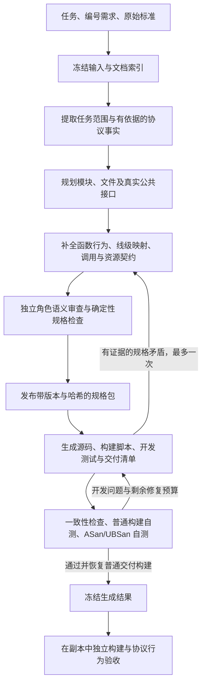

# SpecForge 项目说明：机制、能力与真实实验

用途：论文撰写参考资料，以及后续项目研究与 Codex 会话的事实备忘录。

撰写日期：2026-10-07。调查对象：`/home/ljf/SpecForge` 的 `www` 分支。文档核对时的整理提交为 `94576d307c7c8db07ed4e289ec19412a904e02f3`，核心生成机制对应 `b8a9130d23cd57c975f2f435bb1b1c2304cfee15`。后续仅添加本说明及其阅读入口，不改变该核心机制。

本文根据现有源码、提示词、数据约束、16 次生成的原始状态与用量、构建报告和独立验收报告整理。**当前保留的代表性数据是四轮四协议实验，包含整理代码后的最新一轮，共 16 次协议生成尝试。** 其中前序 R3 与当前稳定机制不同；当前机制的数据集合是 B8-1、B8-2 和最新 C1，共 12 次尝试。此处不声称项目历史上只执行过这四轮。

阅读建议：第 1—5 节介绍方法及其设计理由；第 6—8 节汇报完整实验与失败；第 9—11 节讨论成本、可靠结论和论文论述边界；第 12 节给出证据位置与复核口径。正文侧重协议无关机制，代码与记录位置集中在证据索引。

## 1. 项目定位与已观察到的能力

SpecForge 研究的问题是：在给定应用层网络协议标准和明确功能范围的情况下，如何将自然语言规则逐步转化为一个接口协调、能够构建并接受实际网络交互检查的多文件 C 项目。

系统将生成任务分成三个相互约束的层面：先确定“要求实现什么、规则依据是什么”，再确定“项目如何组织、各部分承担什么可观察行为”，最后完成“如何用代码、构建脚本和测试实现这些约束”。结构化规格在中间承担跨阶段交接作用。固定控制器用检查结果决定阶段能否前进，模型的完成声明不能代替关卡结果。

当前实现后端是 Linux C99，已实际尝试 MQTT 3.1.1 TCP broker、CoAP UDP server、HTTP/1.1 origin server 和 SMTP 本地邮件捕获 server 的指定子集。任务要求多文件源码、公共接口、Makefile、项目 README、开发测试和可执行文件。实现不依赖已有协议服务器或协议解析库作为主体。

**当前机制的 12 次记录中，11 次完成生成关卡，7 次同时通过普通和 sanitizer 两种独立验收。** 最新 C1 生成 4/4，完整独立验收 3/4：MQTT、CoAP、HTTP/1.1 全部通过，SMTP 两种模式均为 12/13。这说明系统已经能交付具有实际网络行为的协议子集实现；它也明确保留了语义失败和预算耗尽的案例。

“稳定基线”在本项目中首先表示已经冻结并可审计的代码、提示词、配置和实验条件，不能解释为每次生成都成功，也不能解释为完整协议合规。四协议都有生成产物，三个协议在当前机制下至少出现过完整验收成功；SMTP 尚没有当前机制下完整通过固定独立套件的记录。

依据：M1、M2、E1—E4。

## 2. 输入、输出与整体工作流程

### 2.1 三类输入及其不同作用

| 输入 | 作用 | 与其他输入的关系 |
|---|---|---|
| 任务说明 | 确定实现角色、目标语言与平台、交付要求及启动方式 | 给出工程任务，不替代协议规则 |
| 编号需求 | 选择协议子集、业务行为、错误政策、数值上限与排除功能 | 规定本次实现必须满足的应用合同 |
| 原始协议标准 | 提供报文格式、状态、交互、错误和生命周期的规范依据 | 标准允许多种行为时，应选择满足任务需求的行为 |

当前标准输入支持具有可提取文本的 PDF 和 UTF-8 文本；一个任务使用一份标准文件，HTTP 案例将两份 RFC 原文合为同一个文本输入。PDF 按提取页组织，文本按每 200 行组织；索引保留块编号、行数和内容哈希。该处理没有实现 OCR，也没有语义检索数据库。模型使用目录、字面搜索和分段读取寻找依据。

需求以 `R01` 等编号传递，当前识别机制依赖 `R数字:` 这种形式。已验证的是现有四个案例的任务格式；任意自然语言需求格式、任意语言或任意文档形态的适用性没有得到实验验证。

### 2.2 工作流程

独立协议行为验收没有返回生成或修复阶段的反馈边。生成内修复可以使用编译、开发测试、sanitizer 和交付一致性证据，不能使用独立套件的失败来继续调整同一次生成。

### 2.3 阶段职责与交接

| 阶段 | 模型承担的工作 | 交接内容 | 控制器检查的主要内容 |
|---|---|---|---|
| 输入准备 | 无模型调用 | 原始输入副本、文档分块与索引、哈希 | 格式、可提取文本、基础工具可用性 |
| 事实提取 | 区分任务选择与协议事实，提取可实现范围和依据 | 任务范围、编号需求、运行合同、事实及原文位置 | Schema、编号覆盖、依据位置、未决问题 |
| 结构设计 | 选择模块、源文件、公共类型与接口 | 模块/文件规格和真实 C 公共头文件 | 文件归属、依赖、符号及编译器接口检查 |
| 行为规格 | 描述具体算法或事件行为、错误处理、线级编码、调用与资源契约 | 函数规格、规划向量、需求与事实的溯源关系 | 函数覆盖、引用、跨文件契约、接口与溯源一致性 |
| 语义审查 | 从已批准范围和事实重新推导行为，核对算法、向量和交互 | 修正后的规格、逐需求审查记录 | 完整规格检查，以及每条需求的审查记录存在 |
| 实现与开发验证 | 编写和调试整个项目，包括自己的测试与清单 | 源码、公共头文件、Makefile、README、开发测试、交付清单和二进制 | 清单/接口一致性，普通和 sanitizer 构建及自测，最终普通构建 |
| 独立验收 | 无模型调用 | 副本中的构建、交互、行为与诊断报告 | 两种构建、所有必需场景实际执行并通过、原交付未变 |

单项目内部采用固定次序的角色协作。事实、规划/审查和编码三类角色共用同一模型配置；结构设计、行为规格和审查分别启动有界任务与上下文。四协议同时执行是外部实验编排的并行，不是同一个项目中多个模型并行协商。

依据：M1—M4、M6。

## 3. 结构化规格如何承担跨阶段约束

### 3.1 三层中间表示与真实接口

| 层次 | 表达的信息 | 主要解决的问题 |
|---|---|---|
| 模块层 | 模块职责、文件归属、模块依赖与生成顺序描述 | 将业务范围分解为有边界的项目结构 |
| 文件层 | 源文件与头文件、公开类型和符号、依赖、计划接口及文件级向量 | 明确接口由谁定义、哪些文件可以使用哪些符号 |
| 函数层 | 签名、依赖、算法或事件处理、输入输出、状态与错误、线级映射、调用契约、测试向量 | 将协议义务转化为可实现的局部行为和协作要求 |

规划阶段同时生成真实 C 公共头文件，而不是只给出文字签名。函数规格的结构化签名、文件规格中的声明和实际头文件由编译器探针交叉检查。公开结构成员类型、枚举值、回调类型、别名以及组合包含的一致性也进入检查。

这组中间表示不是能够自动执行和证明全部语义的形式化语言。许多算法、状态变化、结果含义和资源义务仍是受结构约束的自然语言；向量的输入与期望也是模型生成的数据。确定性工具能够检查结构、引用和可编译接口，不能普遍证明算法满足标准，或证明所有规划向量正确。

### 3.2 将局部函数放回完整处理链

网络代码的错误经常发生在“调用者怎样使用返回值”，而不只发生在单个函数内部。例如，字段值、编码后长度、完整报文长度和已消费字节数是不同量；资源借用和资源转移也具有不同生命周期。

当前规格因此显式记录线级映射、跨文件调用的参数与返回含义、所有权、失败条件，以及需求经过哪些处理步骤实现。审查要求同时阅读调用者和被调用者，核对成功结果、游标变化、失败行为与清理义务。任务要求的多参与者交互，还需要检查事件就绪条件、描述符模式和被动接收方的输出进展。

其中公开跨文件调用契约的存在和签名一致性具有机器检查；其返回单位、所有权和错误政策是否真正正确，主要依赖模型审查与后续执行证据。不能把“字段已填写”解释为这些语义已得到证明。

### 3.3 可追溯性与可检查性

需求与事实、规格位置及规划测试向量形成映射；工程选择另外记录，避免将任务指定的资源或实现策略当成标准强制要求。机器检查需求集合完整、引用可解析、相关事实存在以及测试向量位置有效。开发测试清单还须覆盖每条已批准需求，并引用存在的规格向量。

这使遗漏接口、未知符号、悬空引用和清单脱节能够形成明确诊断。它对语义覆盖的保护有边界：保留了需求编号或关联了一个向量，不等于保存了该需求的全部条件、数值上限和错误优先级；声明测试覆盖一条需求，也不等于其断言覆盖了所有合法交互。

依据：M3、M4；失败实例见第 8 节。

## 4. 影响质量、稳定性与成本的关键机制

### 4.1 带依据的范围提取

系统把标准中的规范事实与任务选择分别保存，要求事实指向原始文档块和行区间，保留需求编号与来源位置，不允许留下范围内未决问题。其目的在于让后续设计有明确的规则来源，降低凭熟悉协议补全或扩大范围的风险。

当前检查保证的是引用位置真实存在、文本非空以及编号对齐，不检查原文是否逻辑蕴含该事实，也不逐项比较需求描述是否完整保留原文字义。B8-1 的 SMTP 上限遗漏表明，这个语义缺口可能继续传播到正确编译的实现中。

### 4.2 接口先定、发布后约束实现

规格发布前先检查文件/符号归属、函数覆盖、跨文件契约、真实公共头文件及溯源。发布包包含索引、摘要、版本、启动合同和内容哈希。编码阶段收到已发布规格的只读视图，公共头文件在工作目录也被固定；源码、私有辅助函数、构建脚本和开发测试仍由编码角色选择。

这种分工把跨模块接口的自由度集中在规划阶段，防止各源文件在实现时自行重新定义公共类型和约定。最初的项目准备只复制规划后的公共头文件，没有提供现成协议服务器、源码模板或控制器编写的项目测试。

编码角色不挂载原始标准、人工 MQTT 测试样本或独立协议验收器。信息交接明确，但也意味着上游遗漏或错误规则不一定能由编码角色发现：它可能忠实实现了一个错误规格。

### 4.3 角色独立的语义审查

行为规格作者完成后，控制器移除作者的检查点和已有审查声明，用新的任务上下文要求审查角色重新从范围与事实推导行为。审查覆盖具体字节和长度、算法执行结果、规划向量、错误规则优先级、重复操作中的资源生命周期及多参与者 I/O 进展。修订后要更新所有受影响的规格和向量，并立即记录逐需求检查结果。

这种“独立”指角色和任务上下文的分离。审查仍使用同一模型、同一上游范围与事实，并且会修改被审查规格；它不具有不同模型、人工专家或外部标准答案带来的统计独立性。机器关卡只验证逐需求审查记录非空及规格一致性，不能证明记录中的论证成立。HTTP 和 SMTP 的独立失败，以及审查后仍出现的规格矛盾，都说明该机制有实际边界。

### 4.4 控制器拥有完成判定权

模型可主动请求阶段检查；控制器也会在无工具的完成响应、预算末尾和检查点转换等位置运行关卡。模型的文字声明不直接将阶段标记为成功。执行真实检查时产生的错误和写入失败会保留为反馈，并在上下文重建后继续提供。

这使结构缺失、接口冲突、交付遗漏和构建失败能阻止错误完成。代价是“尚未成功结束”也可能成为失败：B8-2 的 CoAP 做过语义修订，但没有在 60 次审查响应内补齐必须的完成记录，因此未发布规格、未进入编码。

### 4.5 开发反馈与外部验收分离

开发关卡执行交付一致性检查、干净普通构建与自测、ASan/UBSan 构建与自测，最后重建普通可执行文件。sanitizer 检查包括实际 instrumentation 的证据和诊断；测试不能悄悄替换正在接受检查的二进制。对于同一控制器实例内未改变的项目，已有开发验证可以按项目哈希复用，最后一个验证阶段不必重复整套构建。

编码提示要求开发测试启动真正的可执行文件并检查网络交互，同时覆盖需求、错误和资源路径。机器可以检查清单、引用、执行退出状态及构建结果，却没有分析每条测试断言的充分性。生成测试与实现共享同一规格，二者可能认可相同错误。

外部验收在交付副本中使用固定协议套件，分别重建普通与 sanitizer 版本并执行全部必需场景，原项目前后哈希必须不变。评测开始后，原生成任务被冻结。这个隔离设计使实验能够暴露开发自测遗漏，并保留失败；它不等于为标准全部行为提供外部证明。

### 4.6 有证据、分责任的有界修复

实现层问题由编码角色继续修改现有项目，并使用具体开发错误定位。若公共接口或规格本身矛盾，编码角色必须提交规格引用、精确问题和已有命令日志/开发报告；不能自行选择一种相冲突的解释。

一次生成最多允许一次规划回修：先保留旧规格和项目快照，建立新规格修订，回到原始事实与现有规格修正，再进行完整语义重审和发布。现有源码继续保留，并调整到新的接口。实现续修最多三轮，每轮 40 次响应。这一通道在 MQTT 和 CoAP 记录中实际使用，并存在最终独立验收成功的实例。

规格回修沿用行为规格任务的 180 次响应上限，随后重审上限为 60；它不是一个仅有 40 次响应的小修补。一次很局部的矛盾可能引起整个规格包重审和后续代码调整。修复通道的可用性与修复的实际成本需要分别评价。

### 4.7 有界工具循环与磁盘检查点

| 任务 | 完成响应上限 |
|---|---:|
| 事实提取 | 40 |
| 结构设计 | 100 |
| 初始行为规格 / 规格回修 | 每个任务 180 |
| 语义审查 / 规格回修后的重审 | 每个任务 60 |
| 初始编码 | 180 |
| 实现续修 | 每轮 40，最多三轮 |

响应预算包含读取、保存、检查和修正。一个模型响应可含多个工具调用，模型响应数不等于工具执行数。工具按原生顺序执行；输出截断的响应不执行其中的部分工具调用。

在还有足够响应时，每经过 24 次响应或最近输入用量超过 64,000 Token，控制器要求将进度和下一动作写入磁盘检查点，再以任务、角色指令、检查点和已保存反馈重建上下文。最后 12 次响应保留收尾修复窗口，提前提供确定性检查结果。读取、工具输出及命令时间有界；结构化读取可以按 JSON 字段取得原始值，成功构建的长输出不会反复全部返回模型。

检查点的目的在于控制会话长度并保存进度，它不消除跨上下文重读和跨角色重复理解。系统也没有另一个长程调度模型；所有角色使用同一套顺序工具循环。模型服务适配还具有有限的 SDK 传输重试和显式未处理请求的排队重试；这些重试不能与规格/实现修复混算。

### 4.8 可审计的执行隔离与冻结记录

各阶段只挂载自己的可写输出和批准的只读输入；命令在隔离的文件、进程和网络视图执行，宿主模型密钥不传给命令。生成项目的网络测试在一次命令内部启动、交互和停止，以适应命令间独立的网络命名空间。

运行记录保存配置、工具版本、框架与输入哈希、阶段起止时间、模型请求/响应/用量、工具返回、完整命令日志、修复快照、交付哈希和独立结果。续跑检查通过阶段的内容与框架哈希，标记非 fresh；独立验收开始后禁止恢复生成。现有四轮代表性实验均使用新目录，不续跑、不复用中间产物、不人工修改交付。

依据：M1—M6、E1—E4。上述解释区分设计理由与验证力度；第 8—11 节给出成功、失败和尚不能证明的结论。

## 5. 实际生成范围、产物与能力边界

### 5.1 四个案例的目标范围及实际表现

下表的功能范围来自当前任务，不表示每次生成都正确完成全部功能；通过情况来自当前机制的三轮记录，包含最新 C1。

| 协议与角色 | 当前案例要求的核心范围 | 明确不在范围内的代表功能 | 当前机制观察 |
|---|---|---|---|
| MQTT 3.1.1 / TCP broker | CONNECT、QoS 0 订阅和发布、通配符匹配、二进制载荷、多客户端路由、分帧/合帧与 EOF、PING、断开及资源清理 | QoS 1/2、保留消息、Will、持久会话、UNSUBSCRIBE、认证、TLS、空闲 keepalive 调度 | 3/3 完整通过；每次两种模式 16/16，最新发生规格及实现回修 |
| CoAP / IPv4 UDP server | CON/NON、消息关联、0—8 字节 Token、扩展 option、`/hello` 和二进制 `/value`、重复 CON 去重、错误与资源清理 | 主动 CON 重传、单独响应、Observe、Block-wise、代理、组播、DTLS、持久化 | 2/3 完整通过，成功记录两种模式 10/10；一次规格审查耗尽预算 |
| HTTP/1.1 / IPv4 TCP origin server | GET/HEAD/PUT/POST、二进制值及 echo、Content-Length/chunked、流水线、持久连接、错误政策、限长及 EOF | TLS、HTTP/2/3、代理、升级、文件服务、认证、缓存、持久化等 | 2/3 完整通过；一次两种模式 9/13，后两次 13/13 |
| SMTP / IPv4 TCP 本地捕获 server | EHLO/HELO、MAIL/RCPT/DATA、dot transparency、多收件人、会话重置、错误码/限长、JSON 邮件捕获 | 邮件中继与外发、DNS/MX、投递队列、生产持久性、MIME/RFC 5322 验证、认证、TLS及扩展协商 | 3/3 完成生成，0/3 完整通过；两种模式依次 12/13、11/13、12/13 |

这些任务包含明确的应用选择。例如 CoAP 和 HTTP 的 `/value` 上限为 1024 字节，HTTP 请求目标及头/尾字段还有单独限长；SMTP 限定 100 个收件人和 65,536 个去除透明点后的 DATA 字节。资源名字、收件人名单、捕获格式和这些应用政策不能写成整个协议标准的通用要求。

### 5.2 最终交付包含什么

完成生成的项目包含多文件 C 源码、规划后的公共头文件、模型编写的 Makefile、描述实际设计和使用方式的 README、模型编写的开发测试与测试数据、交付清单以及按任务合同启动的普通可执行文件。规格、输入和报告保留在运行目录，与交付项目分别组织。

生成产物的目录、模块数、接口粒度及事件处理方案由模型根据同一组通用规则选择；当前控制器没有为四个协议选择不同的生成器或固定项目模板。下面是最新 C1 的实测产物规模，不将其当成固定架构。

| 协议 | 文件规格数 | 函数规格数 | 项目 .c 文件数 | 项目 .h 文件数 | 任务启动合同 |
|---|---|---|---|---|---|
| MQTT | 8 | 79 | 8 | 7 | `./mqtt_broker <port>` |
| CoAP | 7 | 49 | 7 | 6 | `./coap_server <port>` |
| HTTP/1.1 | 9 | 44 | 9 | 8 | `./http_server <port>` |
| SMTP | 8 | 52 | 10 | 8 | `./smtp_server <port> <mail-dir>` |

“文件规格”对应计划的源文件；项目 `.c` 数还可能包含新添私有源文件或 C 开发测试，因此两列不要求相等。函数规格数表示纳入规划的接口与处理函数，不是全部私有实现函数数，更不是交付完整性的独立指标。

`assets/mqtt_reference/bundle` 是原有回归测试依赖的固定规格样本，约 692 KB，用于检查规格、接口、交付和阶段控制。正常四协议 fresh 生成不读取它。人工样本输入的 Spec-only 模式仍存在，但它跳过了原始文档到规格的任务，不能计为本节端到端能力证据。

### 5.3 当前能力的适用范围

目前有证据的是四个明确范围的 Linux C99 协议服务器子集，在本地网络、固定启动合同、有限资源边界和固定验收套件下的表现。原始标准虽保留全文，任务本身并不要求完整标准实现。没有生产部署、广域网络压力、长期运行、崩溃恢复、全面安全审计或完整 RFC 合规的证据。

协议无关性体现为同一套流程、规格结构和检查机制被复用于四个协议；不能据此断言对任意协议、任意规模、任意平台或模型未见过的标准同样有效。各协议独立套件和业务需求仍是人工选择的实验资产。

依据：M2—M6、E1—E4、I1—I4。

## 6. 实验设置、版本与统计口径

### 6.1 保留的四轮代表性实验

| 本文标签 | 运行时间（北京时间） | 对应内容 | 编排方式 | 版本关系 |
|---|---|---|---|---|
| R3 | 2026-10-02 20:51—22:33 | 前序 JSON 字段读取等机制实验的冻结运行 | 先完成 MQTT，再并行 CoAP/HTTP/SMTP | 冻结内容与 B8 四个框架文件不同 |
| B8-1 | 2026-10-03 00:03—01:02 | 稳定代码第一轮 | 四协议并行 | 核心提交 b8a9130 |
| B8-2 | 2026-10-03 01:02—01:56 | 同一稳定代码第二轮 | 在 B8-1 后开始，四协议并行 | 核心提交 b8a9130 |
| C1 | 2026-10-07 13:47—14:40 | 整理代码后的最新验证轮 | 四协议并行 | 恢复并核对 b8a9130 核心内容 |

R3 的输入、验收器和模型配置与 B8 一致，但规划/编码提示词、工具实现及一个测试模块的冻结哈希不同。其 `base_commit` 是工作区修改前的提交，不能把这个字段当成实际运行树的完整版本标识。R3 之后另有只做离线/框架检查的收尾修改，也不能将该修改的验证归入 R3 模型实验。

因此本文完整展示四轮，但主要的当前机制能力与成本统计只用 B8-1、B8-2、C1。R3 用于展示形成过程和失败类型，不与当前版本混算成成功概率。更早的跨版本、不同输入、续跑和未完成诊断记录已归档；其数量和成本不与这里的同条件集合相加。

### 6.2 共同模型、环境及运行条件

| 项目 | 记录中的设置 |
|---|---|
| 模型入口 | DeepSeek Chat Completions，`deepseek-flash` |
| 推理与生成 | high reasoning、thinking enabled、非流式，输出上限 65,536 Token |
| 任务响应及回修上限 | 第 4.7 节的固定预算；规格回修最多 1 次，实现续修最多 3 次 |
| 运行记录中的宿主 Python | 3.12.9；项目声明最低 3.11 |
| 固定 Python 运行依赖 | OpenAI SDK 1.97.0、jsonschema 4.24.0 |
| 构建与隔离工具 | GCC 12.3.0、GNU Make 4.3、bubblewrap 0.6.1 |
| PDF 提取 | pdftotext 22.02.0 |
| 互通验收外部客户端 | MQTT 使用 mosquitto_pub/sub；CoAP 使用 coap-client-notls |
| 新鲜性 | 16 次均为新目录、fresh=true、resumed=false、manual_edits=false |
| 反馈隔离 | 生成阶段不接收独立协议套件；独立验收后不人工补丁、不继续该生成任务 |

这里记录的是模型别名及服务参数；没有底层权重快照、采样种子或全部服务默认参数的完整控制记录。固定本地配置不等于输出确定性，跨日期服务端状态也不能假设完全相同。

框架原有 52 项测试在整理后工作区通过；同步到正式 `/home/ljf/SpecForge` 后又通过一次，目标项目测试耗时 16.258 秒，CLI 启动检查通过。它们检查框架逻辑，不能替代协议生成验收。本文撰写没有追加模型调用或新生成实验。

16 次记录的显式排队重试与终止 API 错误计数均为零；SDK 内部传输重试次数无法从这些日志得知。本文因此将服务完成响应与工具错误、开发返工和阶段预算失败分别汇报。

### 6.3 如何理解各项指标

| 指标 | 本文口径 | 不应混用的口径 |
|---|---|---|
| 生成通过 | 完成所有生成阶段，交付一致性和开发关卡通过 | 不等于独立协议行为全部通过 |
| 完整独立通过 | 普通和 sanitizer 构建后，所有必需场景都实际通过 | 环境阻塞、跳过、未执行都不计通过 |
| 总 Token | 输入 Token + 输出 Token | 推理已在输出中，缓存命中已在输入中，不再重复相加 |
| 模型调用数 | 有日志的完成响应数；一个响应可以有多个工具调用 | 不包括不可观察的 SDK 内部 HTTP 重试次数 |
| 阶段墙钟 | 单个阶段记录的 elapsed_seconds，包含该阶段调用与本地处理 | 不能等同单纯模型 API 时间 |
| 累计模型时间 | 完成调用端到端耗时之和 | 包含服务与传输等待；不是纯推理计算时间 |
| 每协议总时间 | 该次生成、独立验收及外层编排的 elapsed_seconds | 不是四协议并行轮的等待时间 |
| 每轮墙钟 | 从该轮启动到结束的实际等待时间 | 四协议并行不能把各协议时长相加 |
| 控制器修复轮数 | 显式规格回修或实现续修任务次数 | 同一个编码任务内的编辑、重编译和重测不另算一轮 |

阶段和角色是同一批调用的两种划分：Specs 主阶段包含首次语义审查；Code 主阶段包含它触发的规格回修、重审和实现续修。两种表不能相加。Prepare、末尾 Verify 和独立验收不调用模型；末尾 Verify 常复用 Code 中对同一项目得到的验证结果，因此耗时很短不表示没有构建和自测。

依据：E1—E4、M1、M5、M6。

## 7. 四轮真实实验的完整汇报

### 7.1 轮次总体结果

| 轮次 | 生成通过 | 完整独立通过 | 总 Token | 完成响应 | 轮次墙钟分钟 | Spec/实现回修次数 |
|---|---|---|---|---|---|---|
| R3 | 4/4 | 2/4 | 66,279,646 | 1,700 | 101.71 | 1/2 |
| B8-1 | 4/4 | 2/4 | 73,357,728 | 1,862 | 58.51 | 2/4 |
| B8-2 | 3/4 | 2/4 | 58,461,794 | 1,499 | 54.16 | 0/0 |
| C1 | 4/4 | 3/4 | 66,490,693 | 1,678 | 53.83 | 1/2 |

R3 墙钟采用报告创建至完成的时间跨度，与原报告约 6102.320 秒一致；B8 使用各轮计时，C1 使用整轮 sequence 计时。R3 与其余三轮编排不同，因此不能把墙钟差异单独归因为机制效率。

四轮保留记录合计 16 次尝试、15 次生成通过、9 次完整独立通过，累计 264,589,861 Token、6,739 次模型完成。**这是跨版本记录清单的总账，不是当前版本成功率。**

### 7.2 每次生成、构建和独立行为验收

| 轮次 | 协议 | 生成 | 开发/独立构建 | 独立普通 | 独立 sanitizer | 总 Token | 完成响应 | 协议总分钟 | Spec/实现回修 |
|---|---|---|---|---|---|---|---|---|---|
| R3 | MQTT | 通过 | 全部通过 | 16/16 | 16/16 | 16,020,491 | 420 | 47.14 | 1/1 |
| R3 | CoAP | 通过 | 全部通过 | 10/10 | 10/10 | 14,431,571 | 381 | 43.86 | 0/0 |
| R3 | HTTP/1.1 | 通过 | 全部通过 | 12/13 | 12/13 | 17,340,349 | 431 | 47.30 | 0/0 |
| R3 | SMTP | 通过 | 全部通过 | 12/13 | 12/13 | 18,487,235 | 468 | 54.57 | 0/1 |
| B8-1 | MQTT | 通过 | 全部通过 | 16/16 | 16/16 | 13,886,454 | 359 | 42.63 | 0/0 |
| B8-1 | CoAP | 通过 | 全部通过 | 10/10 | 10/10 | 19,500,743 | 484 | 46.13 | 1/1 |
| B8-1 | HTTP/1.1 | 通过 | 全部通过 | 9/13 | 9/13 | 19,037,637 | 472 | 49.53 | 0/0 |
| B8-1 | SMTP | 通过 | 全部通过 | 12/13 | 12/13 | 20,932,894 | 547 | 58.51 | 1/3 |
| B8-2 | MQTT | 通过 | 全部通过 | 16/16 | 16/16 | 13,960,596 | 355 | 45.81 | 0/0 |
| B8-2 | CoAP | 失败 | 未执行 | 未执行 | 未执行 | 11,389,709 | 283 | 39.24 | 0/0 |
| B8-2 | HTTP/1.1 | 通过 | 全部通过 | 13/13 | 13/13 | 19,824,520 | 511 | 54.16 | 0/0 |
| B8-2 | SMTP | 通过 | 全部通过 | 11/13 | 11/13 | 13,286,969 | 350 | 43.69 | 0/0 |
| C1 | MQTT | 通过 | 全部通过 | 16/16 | 16/16 | 16,215,637 | 415 | 53.83 | 1/2 |
| C1 | CoAP | 通过 | 全部通过 | 10/10 | 10/10 | 16,434,896 | 418 | 47.83 | 0/0 |
| C1 | HTTP/1.1 | 通过 | 全部通过 | 13/13 | 13/13 | 16,568,118 | 413 | 51.05 | 0/0 |
| C1 | SMTP | 通过 | 全部通过 | 12/13 | 12/13 | 17,272,042 | 432 | 53.37 | 0/0 |

两种模式场景数相同并不表示只执行了一次：每个已交付项目分别重新构建并执行普通和 sanitizer 套件。表中“构建”同时核对了最终开发 normal/sanitize/delivery 和独立 normal/sanitize；所有完成生成的 15 个项目均通过这些构建。B8-2 CoAP 在规格阶段停止，构建和验收均未执行。

运行证据来自按任务启动合同启动真实交付二进制并进行 TCP/UDP 交互；已完成生成的项目均有这类启动和业务交互记录。能够启动及完成部分场景不表示其他业务行为正确，独立失败仍按表中结果保留。

### 7.3 每次主要阶段耗时、Token 与模型完成

每个模型阶段单元格是 **阶段墙钟分钟 / 总 Token / 完成响应数**。Prepare、Verify 单列秒数，两者 Token 和响应数均为零。小数仅对展示耗时四舍五入，Token 和响应数使用整数原值。

| 轮次/协议 | Prepare 秒 | Facts | Design | Specs+初审 | Code+生成内修复 | Verify 秒 |
|---|---|---|---|---|---|---|
| R3/MQTT | 1.546 | 2.02 / 653,323 / 22 | 6.89 / 1,432,816 / 43 | 18.63 / 6,306,779 / 153 | 19.43 / 7,627,573 / 202 | 0.013 |
| R3/CoAP | 0.012 | 1.68 / 703,116 / 22 | 13.12 / 2,848,031 / 75 | 20.95 / 7,284,090 / 179 | 7.99 / 3,596,334 / 105 | 0.010 |
| R3/HTTP/1.1 | 0.030 | 2.61 / 1,166,274 / 30 | 13.57 / 3,494,808 / 91 | 22.52 / 8,504,471 / 204 | 8.39 / 4,174,796 / 106 | 0.014 |
| R3/SMTP | 0.013 | 1.91 / 464,694 / 13 | 10.20 / 2,735,947 / 69 | 24.55 / 7,540,532 / 176 | 17.79 / 7,746,062 / 210 | 0.010 |
| B8-1/MQTT | 1.552 | 2.26 / 676,532 / 18 | 9.72 / 1,673,195 / 47 | 22.66 / 7,031,762 / 165 | 7.84 / 4,504,965 / 129 | 0.011 |
| B8-1/CoAP | 0.013 | 1.45 / 610,531 / 18 | 7.98 / 2,165,545 / 57 | 20.12 / 8,486,843 / 188 | 16.40 / 8,237,824 / 221 | 0.010 |
| B8-1/HTTP/1.1 | 0.030 | 2.26 / 1,172,432 / 32 | 10.53 / 2,600,312 / 65 | 23.10 / 8,565,858 / 196 | 13.52 / 6,699,035 / 179 | 0.015 |
| B8-1/SMTP | 0.013 | 2.47 / 554,697 / 18 | 11.04 / 2,298,871 / 66 | 23.18 / 8,518,298 / 223 | 21.69 / 9,561,028 / 240 | 0.013 |
| B8-2/MQTT | 1.549 | 1.65 / 730,795 / 18 | 11.32 / 2,181,632 / 59 | 22.04 / 6,092,846 / 148 | 10.64 / 4,955,323 / 130 | 0.012 |
| B8-2/CoAP | 0.015 | 2.04 / 779,359 / 25 | 16.19 / 3,716,438 / 96 | 21.00 / 6,893,912 / 162（失败） | 未执行 | 未执行 |
| B8-2/HTTP/1.1 | 0.035 | 2.65 / 1,583,982 / 40 | 12.79 / 3,813,856 / 92 | 26.20 / 9,215,063 / 225 | 12.24 / 5,211,619 / 154 | 0.016 |
| B8-2/SMTP | 0.011 | 2.62 / 860,434 / 29 | 13.03 / 2,284,043 / 62 | 20.45 / 6,051,540 / 146 | 7.46 / 4,090,952 / 113 | 0.011 |
| C1/MQTT | 1.386 | 2.21 / 1,080,118 / 33 | 8.80 / 1,952,340 / 48 | 25.58 / 6,808,100 / 163 | 17.06 / 6,375,079 / 171 | 0.013 |
| C1/CoAP | 0.015 | 1.70 / 785,995 / 22 | 12.21 / 2,919,070 / 78 | 24.74 / 8,092,933 / 192 | 9.06 / 4,636,898 / 126 | 0.012 |
| C1/HTTP/1.1 | 0.030 | 2.37 / 999,090 / 31 | 9.70 / 1,562,281 / 41 | 28.01 / 8,879,974 / 203 | 10.63 / 5,126,773 / 138 | 0.015 |
| C1/SMTP | 0.013 | 2.43 / 826,184 / 26 | 9.05 / 1,938,277 / 50 | 24.30 / 7,709,846 / 180 | 17.48 / 6,797,735 / 176 | 0.015 |

阶段时间依据各 `run.json`，用量依据同一调用的 `report.json` 成本归属；16 次总量已与原始运行用量和角色任务用量交叉核对。此表完整包含 R3 与整理后的 C1，不只覆盖早期三轮。

C1 还单独记录了独立验收命令耗时：MQTT 8.768 秒、CoAP 6.271 秒、HTTP/1.1 19.735 秒、SMTP 5.708 秒，均不调用模型。各协议总时间还包括 CLI 启动与外层记录开销，不能要求表内阶段时间直接等于总时间。R3 没有单列独立验收命令计时，只有与外层开销合并的记录，不补造该项数字。

### 7.4 当前机制的同版本汇总

| 协议 | 尝试数 | 生成通过 | 完整独立通过 | 平均 Token/尝试 | 平均完成响应 | 平均协议总分钟 |
|---|---|---|---|---|---|---|
| MQTT | 3 | 3/3 | 3/3 | 14,687,562 | 376.33 | 47.42 |
| CoAP | 3 | 2/3 | 2/3 | 15,775,116 | 395.00 | 44.40 |
| HTTP/1.1 | 3 | 3/3 | 2/3 | 18,476,758 | 465.33 | 51.58 |
| SMTP | 3 | 3/3 | 0/3 | 17,163,968 | 443.00 | 51.86 |
| 合计/平均 | 12 | 11/12 | 7/12 | 16,525,851 | 419.92 | 48.82 |

这些比例只是三轮小样本的经验计数。没有足够重复次数估计长期成功概率，也没有单因素消融来把变化归因到某个机制。

最新 C1 的每种模式为 51/52 个场景通过；B8 两轮为 87/94 个已执行场景通过，另有 CoAP 的 10 个场景未执行。当前机制合计每种模式 138/146 个已执行场景通过。该场景比例不能代替完整任务的 7/12，也不能将普通与 sanitizer 重复场景看作独立的新任务样本。

### 7.5 按角色识别真实成本来源

以下累计覆盖 B8-1、B8-2、C1 的 12 次尝试。语义审查包含规格回修后的重审，初始编码不包含单独实现续修。

| 角色 | 输入 Token | 输出 Token | 总 Token | 总 Token 占比 | 完成响应 | 累计模型分钟 |
|---|---|---|---|---|---|---|
| 事实提取 | 10,295,301 | 364,848 | 10,660,149 | 5.4% | 310 | 26.03 |
| 结构设计 | 27,186,701 | 1,919,159 | 29,105,860 | 14.7% | 761 | 131.91 |
| 行为规格 | 61,820,124 | 3,132,834 | 64,952,958 | 32.8% | 1,559 | 217.08 |
| 语义审查（含重审） | 33,204,483 | 929,717 | 34,134,200 | 17.2% | 790 | 73.43 |
| 初始编码 | 50,158,013 | 1,289,885 | 51,447,898 | 25.9% | 1,401 | 96.28 |
| 规格回修 | 1,186,002 | 26,524 | 1,212,526 | 0.6% | 34 | 2.06 |
| 实现续修 | 6,574,730 | 221,894 | 6,796,624 | 3.4% | 184 | 16.40 |

当前机制的结构设计、行为规格、语义审查与规格回修合计占总 Token 的 65.3%。按主阶段，Specs+初审占 46.6%，Code+生成内修复占 33.4%，两者合计 79.9%。两种划分显示相同瓶颈，不能重复累计。

### 7.6 最新 MQTT 的闭环修复过程

| 任务次序 | 角色 | 总 Token | 完成响应 | 累计模型秒 | 结束原因 |
|---|---|---|---|---|---|
| 1 | 事实提取 | 1,080,118 | 33 | 132.034 | 关卡通过 |
| 2 | 结构设计 | 1,952,340 | 48 | 526.425 | 关卡通过 |
| 3 | 行为规格 | 4,774,981 | 112 | 1271.555 | 关卡通过 |
| 4 | 语义审查（含重审） | 2,033,119 | 51 | 245.812 | 关卡通过 |
| 5 | 初始编码 | 1,509,204 | 42 | 191.119 | 报告规格矛盾 |
| 6 | 规格回修 | 35,627 | 2 | 9.842 | 关卡通过 |
| 7 | 语义审查（含重审） | 2,269,171 | 53 | 298.127 | 关卡通过 |
| 8 | 实现续修 | 1,632,881 | 40 | 294.478 | 达到响应上限 |
| 9 | 实现续修 | 928,196 | 34 | 117.459 | 关卡通过 |

此例从规格冲突到规划修订、重新审查及实现续修都有原始记录，最终两种独立验收均 16/16。局部规格回修本身仅 35,627 Token，但初审加重审总计 4,302,290 Token，实现续修总计 2,561,077 Token。它支持“跨阶段矛盾有明确回修通道”的描述，同时说明修复成本不能只统计改规格的那两次响应。

依据：E1—E4；最新 MQTT gap 原文及开发问题另见 E5。

## 8. 失败模式与协议间差异

### 8.1 需求文本在上游被不完整保留

B8-1 SMTP 的输入要求每事务最多 65,536 个去除透明点后的 DATA 字节。事实提取保留了标准的最低支持容量，但没有完整传递任务规定的最大值；最终实现使用 1,048,576 字节上限。独立套件发送约 66,000 字节后期待 552，实际获得 250。规格引用、编译和自测均能通过，却遗漏了应用约束。

这说明需要分别评价“事实是否有位置依据”和“完整任务政策是否进入后续约束”。只检查需求编号、来源行号或可解析溯源不能排除字义遗漏。

### 8.2 规格自洽但偏离任务的交互政策

R3 HTTP 的规格将是否继续连接部分绑定到 `status < 500`，使合法未实现方法返回 501 后关闭连接；两种模式均 12/13。B8-1 HTTP 则将所有 4xx/5xx 都设为关闭连接，违背应用错误后继续处理同连接请求的任务政策，两种模式均 9/13。审查把标准允许关闭的一个选择当成能替代任务明确要求的选择，编码忠实照规格实现。

B8-2 和 C1 HTTP 都达到 13/13，但这是相同输入下不同生成产物的观察；没有人工针对前轮验收结果修补同一交付，也不能据此说某一个机制修复了全部连接政策问题。

### 8.3 正确规格在实现中被错误条件替代

R3 SMTP 明确要求普通收件人的 local-part 区分大小写，域名及保留的 postmaster 名不区分大小写。规格保留了这些区别，实现却对普通 local-part 也使用不区分大小写比较，错误接受大写用户名；两种独立套件均期待 550、获得 250，结果 12/13。

此例与上游遗漏不同：需要检查实现是否遵守了已经明确的条件，而不是继续补充协议事实。固定接口和符号一致也不能证明分支条件符合规格。

### 8.4 算法、线级编码和规划向量互相矛盾

R3 MQTT 的 PING 后续 PUBLISH 向量将 Remaining Length 写为 3，却带有 4 字节 body；B8-1 CoAP 的编码常量和过期计数向量也曾产生规格冲突。它们在编码/开发阶段暴露，经过规格回修、重审和实现调整后完整通过独立套件。

C1 MQTT 的文件向量与函数规格对 SUBACK 授予 QoS 有两套相冲突的要求，其中额外 QoS 1/2 输入更暴露了矛盾；另有 PUBLISH 长度向量不一致。编码角色提交具体证据而没有自行覆盖规格，经过一次规格回修和两轮实现续修后 16/16。

这些正反例共同说明，规划向量能帮助发现矛盾，但它们不是天然正确的参考答案。审查要求重新计算精确编码并回放保存算法，仍无法保证全部矛盾在发布前被发现。

### 8.5 修订工作完成了一部分，但阶段没有闭合

B8-2 CoAP 的事实、结构设计和行为规格作者都通过关卡。语义审查进行了多处修订，但达到 60 次响应时，每条需求的必要审查记录仍为空；确定性关卡因此失败，编码与外部验收均未执行。原始日志还显示多次脚本替换和向量索引断言失败，部分 shell 包装退出码为零但输出含断言异常。

准确描述是“做了修订但没有在预算内形成合格交接”，而不是“完全没有审查”或“构建失败”。这类失败与协议语义错误不同：保存纪律、工具操作和固定收尾预算会影响能否完成生成。控制器拒绝错误完成是有效保护，但也暴露了模型执行计划的局限。

### 8.6 固定独立验收合同与规格解释不一致

B8-2 SMTP 的有效 VRFY 输入在规格中被过度限制，产生 501 而非套件要求的 252；TURN 被当成未知命令，产生 500 而非套件要求的 502。两种模式均 11/13。

C1 中 VRFY 对应场景通过，TURN 差异仍在：已识别但未实现的命令列表没有 TURN，于是进入 500 分支，两种模式 12/13。同类失败在原始 B8 中已存在，整理没有修改该规则或验收合同，也没有在独立验收后人为修正产物。

本文依据冻结验收合同记录失败。标准中的历史命令和语法解释有其适用语境，尤其不能将 TURN 的这条固定期望夸大为所有 RFC 语境都逐字强制 502。讨论论文结果时，应交代任务/标准解释和外部 oracle 的边界。

### 8.7 协议差异能说明什么

MQTT 在当前机制三次都完整通过，表现最好，但最新一次仍有明显返工。CoAP 的主要失败是规格审查收尾，而不是 UDP 服务器运行失败。HTTP 暴露了跨请求连接生命周期政策，后两次完整通过。SMTP 三次都能构建、启动并完成大量会话行为，却在限长、参数语义或命令分类上产生不同失败。

因此不能只用“多少需求”“多少函数”或协议名称判断难度。同一个错误政策可影响多个网络场景；同一协议的失败位置也会变化。现有记录更支持从约束传递、相互作用规则、向量一致性和任务闭合分析失败，暂不支持给出稳定的协议难度排名。

依据：E1、E2、E4、E5、E6。定位来源是原有分析及当前规格、源码、失败报告的相互核对；本文没有另行回放网络或改写产物来验证额外推断。

## 9. 成本为什么高，以及现有减负机制的实际边界

### 9.1 主要成本是模型反复处理输入上下文

当前机制 12 次尝试累计 198,310,215 Token，其中输入 190,425,354，占 96.0%；输出 7,884,861，占 4.0%。5,039 次完成响应平均每次约 37,790 输入 Token。平均每次协议尝试约 1,652.6 万 Token、419.9 次完成响应，包括那次提前停止的 CoAP。

日志和执行方式共同解释了这一现象：每次工具往返都以角色指令、任务约束、Schema 和当前对话作为下一请求；之前的助手响应、工具参数和工具返回继续保留，直到检查点重建。适配层也保留服务返回的推理字段。服务端如何将具体字段计入输入属于其实现，本文不将请求字符占比伪装成精确 Token 归因；总输入占比使用服务 usage 原值。

一次局部阅读返回更短，只减少该往返及后续历史的一部分内容，并不消除同一项目数百次请求。当前架构的成本与“有多少相互依赖的规格及接口、需要多少工具交互、同一信息被哪些角色重新处理”紧密相关，不能仅用最终 C 代码长度解释。

### 9.2 规格既是质量机制，也是大块成本

结构设计、行为规格、语义审查、规格回修共消耗约 65.3% 的当前机制 Token。每个计划接口需要结构化行为描述、依赖、契约和相应向量；审查要重新推导这些行为，编码再把它们转化为实现。为了检查跨模块一致性，调用者和被调用者又需共同阅读。这是实际的跨角色重复理解，而不只是某个函数里重复读文件。

这里有真实的质量动机：提前固定接口、让协议义务可定位、让矛盾能够回流规划。但目前没有确定性语义编译器能把这些文字合同一次验证后作为已证明事实复用，所以质量检查仍依赖大量模型阅读和推导。完整语义审查的成本不能简单删去，也不能因成本高就认为每次审查都有足够收益。

### 9.3 多次小操作与高成本返工

B8 原两轮的 8 次记录中，1,405 个完成响应只有原生读取/搜索/列目录工具，占 3,361 次完成的 41.8%；记录 223 个工具错误和 155 次上下文重置。工具错误包括无效字段/引用、读写限制、JSON 格式、不能唯一匹配的替换及证据位置不合格等。这些是工具操作错误，不能称为 223 次模型服务失败，也不能把 41.8% 一律计为无效调用。

检查点控制了会话长度，却可能要求重新读取文件、重新确认调用链。规格缺陷还会触发新版本、重审与实现调整；C1 MQTT 的回修成本就是具体例子。相比之下，开发构建和独立验收不产生模型 Token，主要费用来自模型为诊断、修改和解释这些检查而进行的调用。

当前机制累计模型调用耗时 33,791.971 秒，约占生成主阶段累计墙钟的 96.4%。这是含服务/网络等待的调用时长比例，不是 GPU 计算利用率。主要时间瓶颈在模型交互，而不是实验最后几秒到几十秒的网络验收。

### 9.4 当前局部减负措施已经存在，但没有全面降本证明

已实现的措施包括按需分块/字段读取、紧凑 Schema、有界工具输出、成功构建输出的简化反馈、未改变项目的验证复用、批量独立读取/计算提示和磁盘检查点。R3 还保留了离线等值读取/报告对照，说明可以减少返回页数或字符而保持原值；离线字符下降不能直接换算成整个生成任务的 Token 收益。

输入缓存命中占当前机制输入约 86.9%。总 Token 包含这些输入，不能把总量等比例换算为现金费用，也不能据此推断延迟。现有记录没有提供足够的计价与服务内部计算数据，本文不报告推算金额。

当前系统既有固定版本内的自然波动，也有不同完成程度的运行。B8-2 相比 B8-1 总 Token 更低，但 CoAP 没有进入编码，不能记为机制优化成功。C1 没有修改生成机制，完整通过从每轮 2/4 变为 3/4，也不能单独归因为清理带来的质量提高或 Token 优化。

现有证据支持“高消耗具有结构性的多阶段/工具交互来源”。它不能给出保留全部质量机制后可达到的 Token 下界，也不能证明相对另一代码 Agent 的固定倍数优势或劣势；需要相同任务、完成标准、服务用量口径及重复次数的对照实验才能讨论这些问题。

依据：M1、M3—M5、E1、E2、E4。

## 10. 从当前系统得到的可靠认识

### 10.1 真正已经实现并得到运行证据的部分

| 认识 | 现有支持 | 结论的力度 |
|---|---|---|
| 同一流程可处理多种协议子集 | 同一核心配置执行 TCP broker、UDP 服务、HTTP 和 SMTP 捕获任务 | 支持四案例复用，不支持任意协议泛化 |
| 结构化规格可以形成可实施的多文件交接 | 公开头文件、函数/文件索引、跨文件契约、交付清单及 15 个可构建交付 | 支持接口组织与执行能力，不证明语义完备 |
| 固定控制器能阻止缺失交接被报告为成功 | CoAP 未完成审查记录时停止，构建/清单错误能产生确定性反馈 | 支持完成纪律，不证明模型总能按预算闭合 |
| 规格矛盾可经有证据回修形成最终成功产物 | MQTT、CoAP 的规格回修和最终完整通过 | 支持修复通道可用，缺少其独立因果收益或最优成本证明 |
| 开发验证与外部验收分离能暴露剩余缺陷 | 多个项目开发通过却在固定独立场景失败，交付原件未改 | 支持验收隔离的诊断价值，不证明套件外正确性 |
| 冻结记录足以复核完成程度和成本 | 16 次用量对账、版本审计、阶段状态、构建与交互报告 | 支持实验可审计，不等于相同模型输出可精确重现 |

论文可以围绕“从证据化范围到可检查接口，再到受约束实现与隔离验收”的方法链组织贡献。这里的“有效”首先是机制实际运行并形成可检查结果；没有消融实验时，不应写成每项机制都统计显著提升了成功率。

### 10.2 当前最明确的局限

语义保证仍依赖模型。证据位置、类型兼容、引用存在、覆盖声明和审查文本是可检查的，但任务含义、错误优先级、算法正确性、向量正确性和测试充分性没有统一的机器证明。错误可以在事实提取、规划或编码任何一层产生，并在后续阶段看起来保持一致。

多角色使用同一模型和上游事实，能够分离任务职责，但可能共享相同误解。接口越细、行为规格越长，审查与交接负担也越大。固定响应预算使总工作有边界，却将收尾能力和工具熟练程度引入结果。高输入量和多次重审是目前显著的实际成本。

观测样本仍少。四个任务都是选择后的子集和服务器角色，已有协议标准很可能在模型训练中出现；没有陌生标准、客户端角色、其他语言/平台或大规模复杂实现的测试。小样本中的成功成员还会改变，SMTP 存在持续但位置不同的剩余失败。

### 10.3 对最新整理验证能说什么

C1 核心、配置、输入和验收器与 B8 对齐，完整性审计通过。两轮 B8 已评测记录中共同通过的场景，C1 都通过；每种模式共同场景为 MQTT 16、CoAP 10、HTTP 9、SMTP 10，没有观测到共同场景回退。SMTP TURN 的失败在原 B8 中已有对应案例。

这支持“没有发现整理引入的代码、路径、依赖或共同已通过场景回退”。它不证明随机生成分布完全相同，也不把 C1 单轮 4/4 生成、3/4 验收提升解释为新的稳定性保证。整理的实际作用是确定当前运行基线、保留必要依赖和实验数据、归档其他历史资产；原有生成机制保持不变。

依据：E2—E6，以及 [当前基线说明](BASELINE.md)。

## 11. 用于论文写作的表述与尚缺证据

### 11.1 可直接用作方法与结果概述的表述

> SpecForge 将应用层协议子集生成分解为证据化范围提取、结构与公共接口规划、行为规格及语义审查、受发布规格约束的实现和开发验证。层次化中间表示显式记录线级行为、跨模块调用与资源契约、需求溯源和规划向量；固定控制器以结构、编译器接口、构建和执行结果判定完成。规格矛盾通过有证据的有界回修处理，外部协议套件在交付副本中独立运行且不参与生成修复。当前保留四轮代表性四协议实验，包含整理后的最新一轮。当前核心版本对应其中三轮、12 次 fresh 尝试，11 次完成生成、7 次同时通过两种独立验收；最新一轮为 4/4 生成和 3/4 完整验收。所有已交付项目的普通与 sanitizer 构建通过，但仍存在需求政策遗漏、向量矛盾、实现条件错误和审查预算耗尽。当前版本累计约 1.98 亿 Token，其中约 96% 为输入；结果表明接口与交付可检查性已经成立，而语义保证和交互成本仍是主要限制。

这段概述应与第 6—7 节的版本和统计表一起使用；它不包含未做过的比较实验或完整合规承诺。

### 11.2 现有数据不能直接支持的主张

| 主张 | 当前缺少的必要证据 |
|---|---|
| 同一版本连续三轮四协议全部成功 | 原始记录本身包含 CoAP 停止及 HTTP/SMTP 独立失败 |
| 全面协议合规、生产可用或通用安全性 | 更广规范覆盖、长期/压力运行、系统安全审计与部署证据 |
| 中间规格语义正确性有形式化保证 | 可执行语义、完备 oracle 或相应证明工具 |
| 每项设计都提高质量或降低 Token | 同条件、足够重复次数的单因素消融 |
| 最新一轮较好是清理或优化的因果效果 | 冻结机制未改变，需区分随机生成和服务波动 |
| 相比其他 Agent 的确定成本倍数或优势 | 相同输入、完成合同、用量口径、反馈边界和重复设计的对照 |
| 当前小样本比例就是长期成功率 | 更大样本和明确随机条件，以及不确定性分析 |

未来论文若加入这些主张，应补足对应实验；这里列的是证据缺口，不是本次文档任务已经实施的新方案。

## 12. 证据索引、复核方法与后续会话备忘

以下链接均相对正式项目根目录。代码和说明纳入 Git；`runs/` 按原规则只在本地保存，远程代码树没有原始运行文件。历史记录内的旧绝对来源路径保持原样，尤其 C1 原始生成发生在整理工作区，后来完整复制到正式项目；不要因此改写哈希、命令或日期。

### 12.1 机制证据

| 编号 | 依据 | 支持的内容 |
|---|---|---|
| M1 | [阶段控制](specforge/pipeline.py)、[有界工具循环](specforge/agent.py)、[模型适配及用量](specforge/llm.py) | 固定阶段、模型与角色、预算、检查点、修复归属、完成判定和调用口径 |
| M2 | [输入与事实检查](specforge/documents.py)、[事实提取指令](prompts/facts.md) | 冻结/分块、需求来源、事实依据及其校验边界 |
| M3 | [模块约束](schemas/module_spec_schema.json)、[文件约束](schemas/file_spec_schema.json)、[函数约束](schemas/function_spec_schema.json)、[范围/溯源/发布/交付约束](schemas/artifacts.schema.json) | 中间表示真实字段、结构范围及非形式化语义边界 |
| M4 | [规格、ABI 与发布检查](specforge/specs.py)、[规划指令](prompts/planner.md) | 编译器探针、接口/引用/契约检查、发布与只复制头文件的交接 |
| M5 | [编码指令](prompts/coder.md)、[开发关卡与修复](specforge/pipeline.py)、[工具与隔离执行](specforge/tools.py) | 开发测试义务、只读接口、构建/sanitizer、日志预览、修复和命令隔离 |
| M6 | [独立验收控制](specforge/evaluation.py)、[MQTT 套件](evaluation/mqtt_check.py)、[CoAP 套件](evaluation/coap_check.py)、[HTTP 套件](evaluation/http11_check.py)、[SMTP 套件](evaluation/smtp_check.py) | 两种模式、必需场景数、固定外部行为合同、交付不变和评测冻结 |

### 12.2 输入与实验来源

| 编号 | 来源 | 阅读重点 |
|---|---|---|
| I1 | [MQTT 任务](cases/mqtt_min/TASK.md)、[需求](cases/mqtt_min/REQUIREMENTS.md)、[标准 PDF](cases/mqtt_min/spec/mqtt-v3.1.1-os.pdf) | broker 子集、QoS 0、二进制、分帧、EOF 与排除范围 |
| I2 | [CoAP 任务](cases/coap_min/TASK.md)、[需求](cases/coap_min/REQUIREMENTS.md)、[RFC 原文](cases/coap_min/spec/rfc7252.txt) | UDP、消息关联、重复去重、1024 字节资源与排除范围 |
| I3 | [HTTP 任务](cases/http11_min/TASK.md)、[需求](cases/http11_min/REQUIREMENTS.md)、[RFC 合并原文](cases/http11_min/spec/rfc9110-rfc9112.txt) | 资源、请求体与流水线、应用错误后的连接政策及限长 |
| I4 | [SMTP 任务](cases/smtp_min/TASK.md)、[需求](cases/smtp_min/REQUIREMENTS.md)、[RFC 原文](cases/smtp_min/spec/rfc5321.txt) | 本地捕获、地址、事务、回复码、限长和排除范围 |
| E1 | [R3 冻结](runs/cost_optimization/20261002T125031Z_json_fields/freeze.json)、[机器报告](runs/cost_optimization/20261002T125031Z_json_fields/report.json)、[分析](runs/cost_optimization/20261002T125031Z_json_fields/RESULTS.md) | 前序运行版本、4 次成本、失败、离线收益与实验后修改的边界 |
| E2 | [B8 冻结](runs/stability/20261002T160137Z_two_rounds/freeze.json)、[机器报告](runs/stability/20261002T160137Z_two_rounds/report.json)、[成本汇总](runs/stability/20261002T160137Z_two_rounds/cost-summary.json)、[分析](runs/stability/20261002T160137Z_two_rounds/RESULTS.md) | 同版本两轮的 8 次记录、阶段/角色成本、工具诊断和失败证据 |
| E3 | [历史版本核对](runs/validation/20261007T053821Z_cleanup_one_round/history-version-audit.json)、[基线说明](BASELINE.md) | R3 与 B8 的四项哈希差异，当前核心与输入/验收器一致性 |
| E4 | [C1 冻结](runs/validation/20261007T053821Z_cleanup_one_round/freeze.json)、[机器报告](runs/validation/20261007T053821Z_cleanup_one_round/report.json)、[结果说明](runs/validation/20261007T053821Z_cleanup_one_round/RESULTS.md)、[完整性检查](runs/validation/20261007T053821Z_cleanup_one_round/final-integrity.json) | 整理后最新一轮、4 次成本与行为、原始用量对账、交付未改 |
| E5 | [C1 回修分析](runs/validation/20261007T053821Z_cleanup_one_round/repair-analysis.json)、[MQTT 原始运行](runs/validation/20261007T053821Z_cleanup_one_round/round_01/mqtt_01/run.json) | 规格冲突证据、规划回修、两次审查及实现续修 |
| E6 | [C1 SMTP 定位](runs/validation/20261007T053821Z_cleanup_one_round/smtp-failure-analysis.json)、[历史共同场景对照](runs/validation/20261007T053821Z_cleanup_one_round/baseline-behavior-comparison.json)、[B8 开发失败证据](runs/stability/20261002T160137Z_two_rounds/failure-evidence.json) | TURN 失败、共同场景无回退、原有开发/阶段失败及局部原因 |

每个协议目录中的 `run.json` 是阶段状态、修订、fresh/修复标记、角色用量和环境的原始记录；`reports/verify_*/report.json` 保存开发构建与自测；`evaluation/evaluation_001/report.json` 保存独立构建与场景结果。请求、响应和工具返回保留在该运行的 `logs/`，完整命令输出保留在对应日志和报告目录。

### 12.3 本文指标的复核规则

四轮的目录选择分别为 R3 下四个协议目录、B8 下 `round_01`/`round_02` 各四个协议目录，以及 C1 下 `round_01` 四个协议目录。正文中的 C1 是本文标签，原记录仍写 `round_01`；它是整个保留序列的第四轮，不是遗漏的第五个协议。

每次总 Token 取报告 `cost.input_tokens + cost.output_tokens`，与原始 `run.json` 的汇总用量对账。角色用量按原始任务名称归组，响应次数与各任务 usage 相加；阶段 Token 使用报告的阶段归属，墙钟使用原始阶段 elapsed_seconds。阶段表与角色表都分别对齐总账，不互相相加。

独立通过数使用正式报告 passed 和每个场景的状态，不依据模型文字总结。构建记录核对最后开发关卡的三种构建和独立两种构建。正文产物规模取最终规格修订下文件/函数 JSON 数及交付项目 `.c`/`.h` 数；停止于规格阶段的 CoAP 没有交付源码。

表格仅重新汇总已有记录。本次没有运行生成、独立网络验收或协议补丁，也没有改动上述原始数据。历史日志与更早实验的独立完整备份位于 `/home/ljf/SpecForge-backups/20261007T053821Z/`；正式项目同步与测试证明位于 `/home/ljf/SpecForge-backups/20261007T071859Z_www_sync/`。

### 12.4 后续会话应保留的项目事实

- 正式项目是 `/home/ljf/SpecForge`，维护分支为 `www`；机制冻结于 b8a9130，当前整理内容与文档维护在后续提交中。
- 保留的代表性四协议实验共四轮，**必须包括整理后的 C1**。R3 是前序冻结版本，当前机制统计包含 B8-1、B8-2、C1。
- 生成完成、构建通过、开发自测通过和完整独立验收通过分别记录；SMTP 已知剩余失败不能被项目清理或说明文档改写为成功。
- `assets` 中仅余必要回归规格样本，不是 fresh 生成参考实现。独立协议套件也不参与开发修复。
- 文档数据的原始路径、哈希和版本说明保持不变；新增实验应使用新目录并明确记录机制版本，不恢复旧输出以补齐本报告。
- 后续关于成本或质量的因果主张，应以新增对照/消融和明确完成合同支撑，不能将本说明中的观察自动升级为已证实的优化收益。
