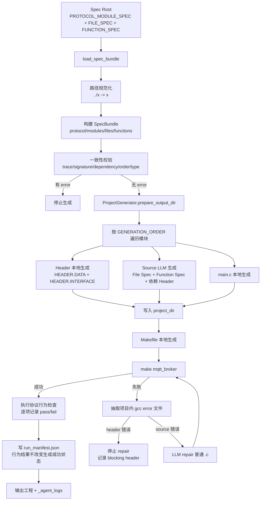
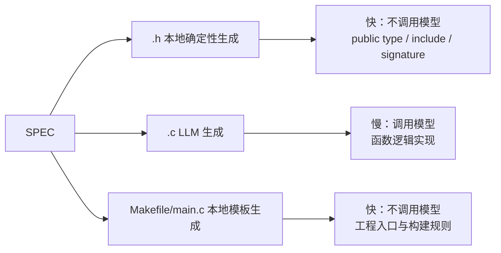
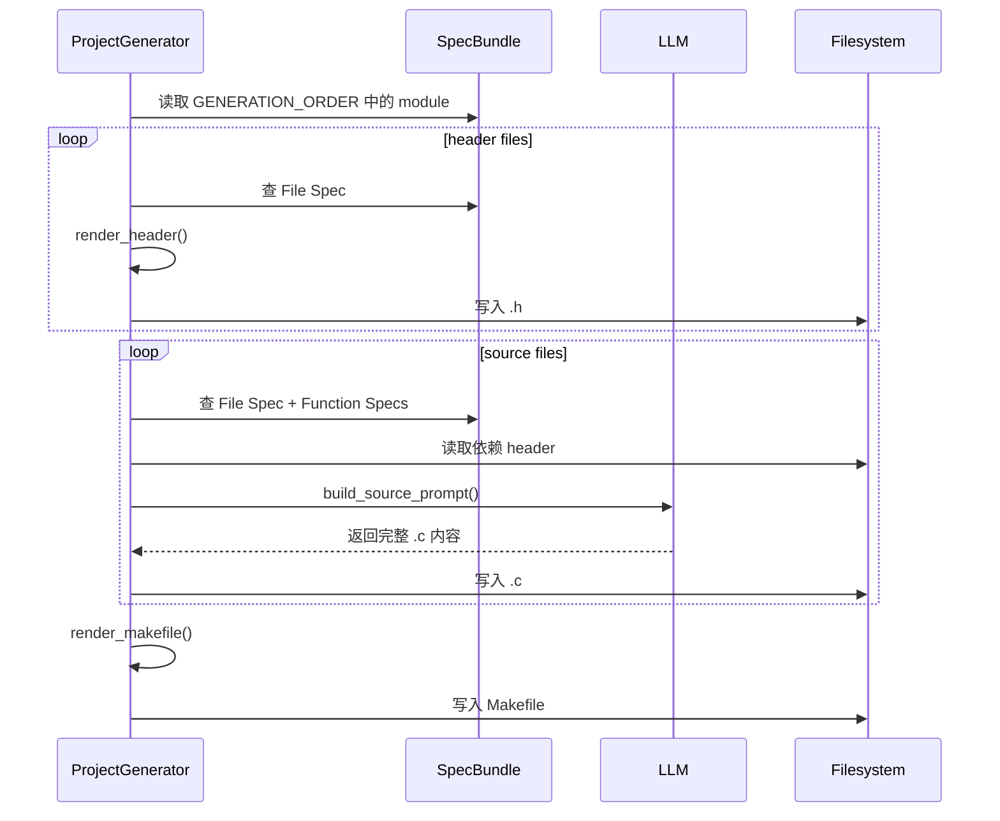

# Spec-to-Code Coder Agent

这个目录实现了一个代码生成 agent（当前以 C 语言的 MQTT broker-only 服务端为示例落地）。

它位于三步流水线的第 3 步：

1. facts：技术文档 -> `protocol_facts.json`
2. planning：`protocol_facts.json` -> 工程规划/规格（spec）
3. coder：规格（spec）-> 可编译的代码工程

当前 `coder` 的核心关注点是：**输入的规格（spec）是什么、如何组织，以及它必须满足哪些一致性约束**。

## 当前工作流程（PPT 版）

`coder` 的端到端流程可以理解为：**加载 SPEC → 校验一致性 → 按模块生成工程 → 编译 → 按错误修复 → 编译成功后执行非阻断行为检查 → 输出 manifest 与日志**。



### 运行目录结构

默认输出目录由 CLI 在运行时生成，形如：

```text
agent/out/<protocol>_<role>_YYYYMMDD_HHMMSS/
├── <protocol>/              # project_dir，真正生成出的协议工程
│   ├── Makefile
│   ├── main.c
│   ├── network/
│   ├── protocol/
│   ├── broker/
│   ├── topic/
│   └── router/
└── _agent_logs/             # prompt、编译输出、manifest、token 用量
    ├── 001_prompt_*.txt
    ├── 0xx_compile_stdout_*.txt
    ├── 0xx_compile_stderr_*.txt
    └── run_manifest.json
```

### 生成策略分层



| 产物 | 生成方式 | 主要输入 | 是否调用 LLM |
| --- | --- | --- | --- |
| `.h` | 本地确定性渲染 | `HEADER.DEPENDENCY` / `HEADER.DATA.TYPE_SPEC` / `HEADER.INTERFACE` | 否 |
| 普通 `.c` | LLM 生成 | File Spec、Function Spec、已生成 header、依赖 header、Consistency Rules | 是 |
| `main.c` | 本地模板生成 | broker/app 模块公开类型与 create/start/run/destroy 接口 | 否 |
| `Makefile` | 本地模板生成 | `GENERATION_ORDER` 后的模块文件列表、协议角色 | 否 |
| repair 文件 | LLM 修复 | 当前 `.c` 文件内容、压缩后的编译错误、canonical header、依赖 header | 是 |

> `.h`、`main.c` 和 Makefile 是本地确定性生成产物，不进入 LLM repair。若编译错误指向项目 header，`generate` 会停止 repair，并在 manifest 中记录 `deterministic_header_compile_error`，提示需要修复 specs 或 header lowering。

> `generate` 的成功条件仅为最终编译成功。编译成功后会自动执行预设协议行为检查，并逐项记录到控制台、`behavior_verification.json` 和 manifest；行为检查失败不会触发 repair、不会覆盖 compile repair 状态，也不会改变 `generate` 的成功状态或退出码。

### 单个模块内的生成顺序



## 输入契约（coder agent 吃什么）

`coder` 的输入是一组 JSON 规格文件（统称 SpecBundle），通过一个规格根目录传入：

1) Module Spec（模块级规格，单文件）
- 位于 `--spec-root` 指向的目录中
- `coder` 会递归扫描并自动发现唯一一个 `KIND == "PROTOCOL_MODULE_SPEC"` 的文件
- 例子：`~/SpecForge/specs-example/mqtt_specs/mqtt_module_spec.json`

2) Spec Root（规格根目录，一整个目录）
- 通过命令行参数 `--spec-root` 指定
- `coder` 会递归扫描该目录下所有匹配 `*_spec.json` 的文件
- 例子：`~/SpecForge/specs-example/mqtt_specs/`

> 注意：正常入口只需要传 `--spec-root`。`--module-spec` 仍保留为兼容性覆盖项；默认情况下 `coder` 会自动跳过已发现的模块级规格文件，避免重复解析。

### 路径与规范化规则

`coder` 在解析时会对所有路径做规范化（见 `normalize_repo_path()`）：

- 把 `\\` 替换为 `/`
- 去掉前后空白
- 反复剥离前缀 `../` 与 `./`

因此 Module Spec 里的 `FILES` 可以写成 `../network/connection.h` 这类形式，最终会归一化成 `network/connection.h`。规格文件里的路径不包含协议名目录；协议名是否作为输出目录的一部分由 `--output-dir` 决定。

## 输入文件 1：Module Spec（PROTOCOL_MODULE_SPEC）

Module Spec 必须是 JSON 对象，并且至少包含：

- `MODULES`: array
- （可选）`CONSISTENCY_RULES`: array

每个 `MODULES[i]` 至少应包含：

- `NAME`: 模块名（用于依赖排序与生成顺序）
- `ROLE`: 模块职责描述
- `DEPENDENCIES`: array[string]（模块依赖，必须在生成顺序里出现在当前模块之前）
- `FILES`: array[string]（该模块要生成/校验的头文件与源文件路径，路径会被规范化）
- （可选）`ARTIFACTS`: array[object]
- （可选）`DOC_REF`: array

`coder` 当前的生成顺序使用 `GENERATION_ORDER` 字段；如果该字段缺失或为空，会退回 `MODULES` 的数组顺序并给出 warning。无论使用哪种顺序，模块依赖都必须在生成顺序里出现在当前模块之前。

## 输入文件 2：File Spec（FILE_SPEC）

Spec Root 目录下，任意 `*_spec.json` 只要满足：

- `KIND == "FILE_SPEC"`

就会被解析为 File Spec。其结构要求如下（只列出 `coder` 读取/校验的关键字段）：

- `FILE`（object）
  - `TRACE_ID`：文件级 trace id（例如 `mqtt/router/message_router`）
  - `LANG`
  - `ROLE`
- `HEADER`（object，可选；无头文件的 `main.c` 可省略；planning 当前要求其他 `.c` 都有唯一对应 `.h`）
  - `PATH`：头文件相对路径（例如 `../router/message_router.h`，规范化后为 `router/message_router.h`）
  - `DEPENDENCY`：`#include "..."` 依赖列表（array[string]）
  - `DATA`：类型/常量等数据项声明（array[object]，目前主要用于头文件 public type 生成）
  - `INTERFACE`：头文件公开接口列表（array[object]）
    - 每项必须包含：`SIGNATURE` / `NAME` / `KIND` / `FUNCTION_TYPE` / `ROLE` / `VISIBILITY`
- `SOURCE`（object）
  - `PATH`：源文件相对路径（例如 `../router/message_router.c`，规范化后为 `router/message_router.c`）
  - `DEPENDENCY`：源文件依赖的头文件列表（array[string]）
  - `DATA`：源文件私有数据项（array[object]）
  - `INTERFACE`：源文件需要实现的接口列表（array[object]）
    - 每项必须包含：`TRACE_ID` / `SIGNATURE` / `NAME` / `KIND` / `ROLE` / `VISIBILITY`

### Source-only File Spec

一般 C 模块同时包含 `HEADER` 和 `SOURCE`。为服务 SpecForge 当前“快速从技术文档生成可用协议代码”的研究目标，planning 默认采用一源一头的简化 specs 架构：除入口 `main.c` 外，每个 `FILE_SPEC` 都应包含自己的 `HEADER.PATH`。入口文件 `main.c` 没有对应头文件时，可以只声明 `SOURCE`，用于描述 broker 启动入口；这种规格仍然可以通过 `SOURCE.INTERFACE[*].TRACE_ID` 关联 Function Spec。

### File Spec 与 Function Spec 的关联

`SOURCE.INTERFACE[*].TRACE_ID` 用于链接 Function Spec。

同时 `coder` 会检查 function trace id 的“父级”必须是某个 File Spec 的 `FILE.TRACE_ID`：

- File Spec: `mqtt/router/message_router`
- Function Spec: `mqtt/router/message_router/mqtt_message_router_publish`

如果 Function Spec 的父级不存在，会报错 `orphan_function_spec`。

## 输入文件 3：Function Spec（FUNCTION_SPEC）

Spec Root 目录下，任意 `*_spec.json` 只要满足：

- `KIND == "FUNCTION_SPEC"`

就会被解析为 Function Spec。其结构要求如下（只列出 `coder` 读取/校验/生成 prompt 会用到的关键字段）：

- `TRACE_ID`：必须能通过 `TRACE_ID.rsplit("/", 1)[0]` 找到对应 File Spec 的 `FILE.TRACE_ID`
- `FUNCTION_TYPE`：例如 `ALGORITHM` / `EVENT`
- `ROLE`
- `SIGNATURE`（object）
  - `RAW` / `NAME` / `RETURN` / `PARAMS`
- `RELY`（object）：描述依赖的 struct/func/var（用于生成 prompt 的上下文）
- `LOGIC` 或 `EVENT`：行为描述（`coder` 会用 `LOGIC`，否则 fallback 到 `EVENT`）

## 子命令一览

`coder` 的命令行全局参数需要放在子命令之前。

```bash
python3 -m agent coder [全局参数] <子命令> [子命令参数]
```

全局参数（部分子命令可省略）：

| 参数 | 说明 | 哪些命令需要 |
|------|------|-------------|
| `--spec-root` | 规格根目录 | `validate` / `generate` / `verify` |
| `--output-dir` | 输出/项目目录 | `generate` / `verify` |
| `--api-key-env` | LLM API key 环境变量名（默认 `ALI_API`） | `validate` / `generate` |
| `--max-repair-rounds` | 最大编译修复轮数（默认 3） | `generate` |

### `validate` — 校验规格

校验输入 spec 的一致性和 LLM 适配器是否可用。

```bash
python3 -m agent coder \
  --spec-root ~/SpecForge/specs-example/mqtt_specs \
  validate
```

### `generate` — 从规格生成工程

加载 spec → 生成代码 → 编译 → repair（如有编译错误）→ 编译成功后执行行为测试。

```bash
python3 -m agent coder \
  --spec-root ~/SpecForge/specs-example/mqtt_specs \
  generate
```

生成的协议工程位于 `<output-dir>/<protocol_slug>/`，日志位于同级 `_agent_logs/`，
`run_manifest.json` 也写入 `_agent_logs/`。日志只保留 prompt、编译输出、manifest 等诊断材料；
manifest 中包含逐次 LLM 调用、按阶段汇总和最终总计的 token 用量。

编译成功后的协议行为检查仅作为**非阻断**检查项：行为测试失败不会触发 repair，
不会覆盖 compile repair 状态，也不会改变 `generate` 的成功状态或退出码。

### `verify` — 校验已有工程

对已生成的工程执行 结构校验 → 编译 → 行为测试 三级流水线。
需要 `--spec-root`（用于结构校验和行为测试路由）。

```bash
python3 -m agent coder \
  --spec-root ~/SpecForge/specs-example/mqtt_specs \
  --output-dir agent/out/mqtt_broker_20260610_185335 \
  verify
```

### `test` — 仅运行协议行为测试

针对已编译好的二进制，**跳过**结构校验和编译，直接执行协议行为冒烟测试。
**不需要 `--spec-root`**，只需指定协议类型、项目目录和二进制文件名。

```bash
python3 -m agent coder test \
  --protocol mqtt \
  --project-dir agent/out/mqtt_broker_20260610_185335/mqtt \
  --binary mqtt_broker
```

参数说明：

| 参数 | 说明 |
|------|------|
| `--protocol` | 协议 slug，可选：`mqtt` / `coap` / `http` / `smtp` |
| `--project-dir` | 已编译二进制所在的项目目录 |
| `--binary` | 入口文件二进制名（如 `mqtt_broker`） |

适用场景：已有编译好的协议二进制，只想快速验证协议行为是否符合预期；
或在 CI 中对同一份二进制反复运行回归测试。

## 协议行为测试覆盖

> **注意：** 当前四个协议（HTTP/1.1、CoAP、MQTT、SMTP）的测试均针对 **min（最小功能）版本**——仅覆盖协议核心功能的最小可用子集（transport、codec/parser、codec/serializer、handler、error、integration），不包含完整 RFC 的所有命令/选项/错误码。测试目标是验证生成的二进制"能跑通最基本的协议交互"，而非协议完备性。

协议行为测试位于 `protocol_behavior_val/` 目录下，各协议场景如下：

### HTTP/1.1（min） — 9 个场景

| # | 场景名 | 验证点 |
|---|--------|--------|
| 1 | `http_tcp_connect` | TCP bind/listen/accept，客户端可连接并收到响应 |
| 2 | `http_get_file` | request-line 解析 + path 路由，GET /hello 返回 200 |
| 3 | `http_head_no_body` | HEAD 方法返回 header 但 body 为空 |
| 4 | `http_404_not_found` | 未知路径返回 404 |
| 5 | `http_400_bad_request` | 畸形请求返回 400 |
| 6 | `http_501_unknown_method` | 不支持的方法返回 501 |
| 7 | `http_response_headers` | 响应包含 Content-Length、Content-Type、Connection: close |
| 8 | `http_connection_close` | 服务器响应后主动关闭 TCP 连接 |
| 9 | `http_smoke_test` | 连续 5 次请求全部返回正确结果 |

### CoAP（min） — 6 个场景

| # | 场景名 | 验证点 |
|---|--------|--------|
| 1 | `coap_get_hello` | UDP transport + codec/parser/serializer + handler：GET /hello → 2.05 Content |
| 2 | `coap_unknown_not_found` | 未知路径返回 4.04 Not Found |
| 3 | `coap_malformed_survival` | 畸形 UDP 数据报不导致服务端崩溃，后续正常请求仍可处理 |
| 4 | `coap_extended_option` | 合法扩展 option delta（> 12）不被误判为畸形包 |
| 5 | `coap_smoke_test` | 连续 5 次 GET /hello 请求全部返回正确 |
| 6 | `coap_client_interop` | 第三方客户端 `coap-client-notls` 互操作（不可用时 skip） |

### MQTT（min） — 6 个场景

| # | 场景名 | 验证点 |
|---|--------|--------|
| 1 | `mqtt_cross_client_pubsub` | transport + codec + session + handler：两个客户端跨客户端 pub/sub |
| 2 | `mqtt_buffer_before_eof` | PUBLISH 后立即 DISCONNECT，broker 在对端关闭前处理缓冲数据 |
| 3 | `mqtt_malformed_survival` | 畸形报文不导致 broker 崩溃，后续 CONNECT 正常接受 |
| 4 | `mqtt_disconnect_handler` | DISCONNECT 正确清理客户端，broker 继续为其他客户端服务 |
| 5 | `mqtt_smoke_test` | 订阅 smoke/# 后 5 轮 pub/sub 全部成功 |
| 6 | `mqtt_mosquitto_interop` | mosquitto_sub / mosquitto_pub 互操作（不可用时 skip） |

### SMTP（min） — 8 个场景

| # | 场景名 | 验证点 |
|---|--------|--------|
| 1 | `smtp_tcp_connect` | TCP 连接后收到 220 服务问候 |
| 2 | `smtp_helo_ehlo` | HELO 命令 → 250 |
| 3 | `smtp_mail_from` | MAIL FROM 命令 → 250，状态推进到 mail_from |
| 4 | `smtp_rcpt_to` | RCPT TO 命令 → 250，状态推进到 rcpt_to |
| 5 | `smtp_data_delivery` | DATA → 354 → 发送邮件正文 → 250 → QUIT → 221 |
| 6 | `smtp_bad_sequence` | 三组乱序命令（MAIL before HELO、DATA before MAIL、DATA before RCPT）→ 503 |
| 7 | `smtp_unknown_command` | 无法识别的命令 → 500，服务端存活并接受 QUIT |
| 8 | `smtp_smoke_test` | 完整 SMTP 事务 + 验证 mail store 目录有新文件产生 |

### 需要的第三方工具

| 工具 | 对应场景 | 是否必需 |
|------|----------|----------|
| 无 | 所有自包含场景（仅用 Python 标准库 socket） | 必需（内置） |
| `mosquitto_sub` / `mosquitto_pub` | `mqtt_mosquitto_interop` | 可选，不可用时 skip |
| `coap-client-notls` | `coap_client_interop` | 可选，不可用时 skip |

安装方式（Ubuntu/Debian）：

```bash
sudo apt install mosquitto-clients libcoap3-bin
```

## 常见输入问题（会影响生成质量）

- File Spec 里声明了 `SOURCE.INTERFACE`，但缺失对应的 Function Spec：会产生 `missing_function_spec` 警告
- Header/SOURCE/Function 三者的函数签名不一致：会产生 `signature_mismatch` / `header_signature_mismatch` 警告
- 不同 File Spec 认领了同一个 `HEADER.PATH` 或 `SOURCE.PATH`：会报错 `duplicate_file_path`
- 非 `main.c` File Spec 缺失 `HEADER.PATH`：属于 planning 输出不完整，可能导致生成阶段无法建立 canonical header 上下文
- 模块依赖顺序不满足（依赖出现在后面）：会报错 `generation_order_violation`
