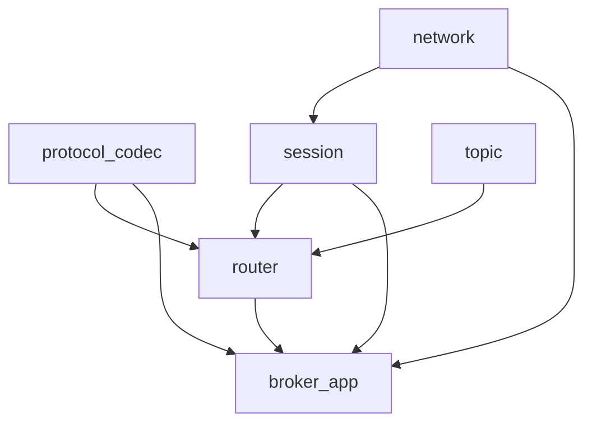
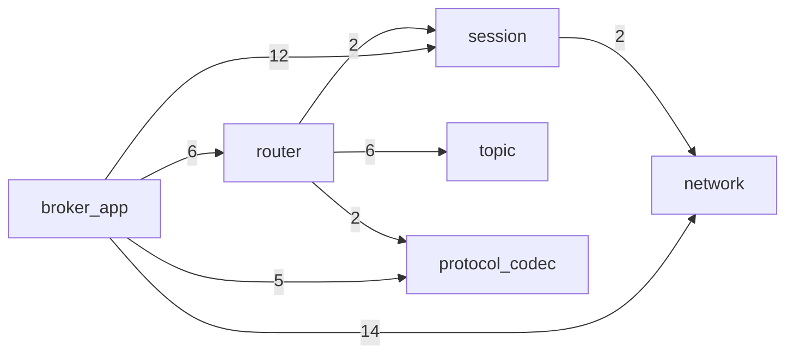
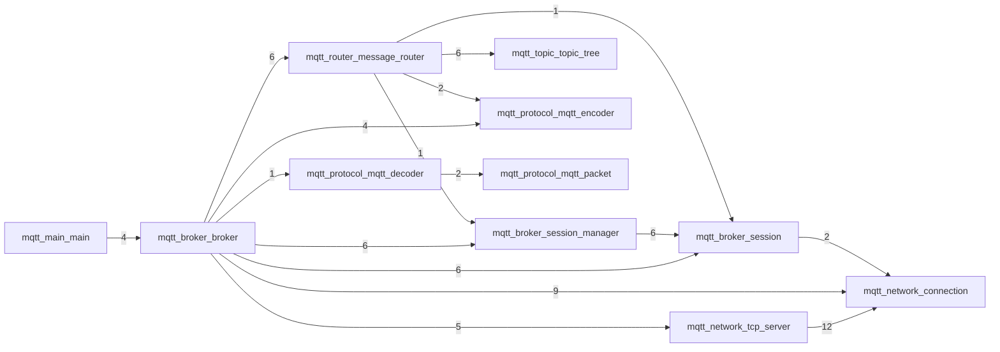

# MQTT specs-example 汇总（基于 specs-example/mqtt_specs）

> 说明：本文件由脚本从现有 JSON specs 自动汇总生成；只抽取 specs 中真实出现的模块、类型、函数与依赖信息，不额外臆造。

## 协议元信息（PROTOCOL_MODULE_SPEC）
- 协议：MQTT 3.1.1
- 角色：BROKER
- Scope：MQTT 3.1.1 Broker subset only; client/subscriber generation is out of scope and external MQTT clients are used for validation.

## 规格清单统计
- JSON 文件总数：101
- KIND 统计：FILE_SPEC=11, FUNCTION_SPEC=89, PROTOCOL_MODULE_SPEC=1

## 生成顺序（GENERATION_ORDER）
- network → protocol_codec → session → topic → router → broker_app

## 一致性规则与禁止符号
### CONSISTENCY_RULES
- C1: 禁止在 network/session/router/broker_app 里手写 MQTT wire-format；所有解析必须通过 mqtt_decoder_feed，所有响应/转发编码必须通过 mqtt_encoder.*。
- C2: network 层不得依赖 mqtt_packet_t / mqtt_encoder / mqtt_decoder；它只能以字节缓冲与回调形式提供服务。
- C3: 会话唯一标识 session_id 必须与 mqtt_connection_fd(conn) 一致；router/topic/session_manager 对 session_id 的含义必须一致。
- C4: topic filter 匹配规则必须与 MQTT 3.1.1 的 +/# 语义一致（# 仅允许出现在末尾）；不符合的 filter 应在上层拒绝或安全处理。
- C5: 生成代码只能使用 canonical header 中出现的公共字段、枚举、类型和函数；未列入 PUBLIC_SYMBOLS/ACCESS_PATHS 的公共符号不得臆造。
- C6: SPEC 生成时必须优先给出符号表、字段映射、调用契约和最小 oracle；不得用宽泛自然语言替代机器可读约束。

### FORBIDDEN_SYMBOLS
- pkt->data (FIELD): mqtt_packet_t 没有 data 字段；packet payload union 字段名是 v
- out->data (FIELD): mqtt_packet_t 没有 data 字段；decode_one 必须写 out->v.*
- mqtt_packet_t.data (FIELD): mqtt_packet_t 的 union 字段名是 v
- mqtt_packet_t.connect (FIELD): CONNECT payload 必须通过 mqtt_packet_t.v.connect 访问
- MQTT_PACKET_TYPE_CONNECT (ENUM): MQTT packet enum 使用 MQTT_PKT_* 命名
- MQTT_PACKET_CONNECT (ENUM): MQTT packet enum 使用 MQTT_PKT_* 命名
- mqtt_topic_filter_t (TYPE): 订阅项公开类型是 mqtt_subscribe_topic_t；topic tree 内部不暴露 filter 类型

## 模块概览（MODULES）
### network
- 角色：TCP/epoll 网络层：accept + 事件循环；连接对象的读缓冲、写队列与关闭；通过回调把连接与数据事件上交给上层。不得解析/构造 MQTT 报文语义。
- 依赖模块：（无）
- 产物（ARTIFACTS）：
  - TYPE: mqtt_connection_t — 不透明连接对象（封装 fd、输入缓冲、输出队列、peer 信息与关闭状态）
  - TYPE: mqtt_tcp_server_t — TCP server（listen/accept + epoll 事件循环 + 读写分发）
  - TYPE: mqtt_tcp_callbacks_t — on_accept/on_data/on_close 事件回调集合
  - FUNC: mqtt_connection_read — 尽可能从 socket 读取到输入缓冲（非阻塞语义）
  - FUNC: mqtt_connection_send — 把待发送字节拷贝入输出队列（稍后 flush）
  - FUNC: mqtt_connection_flush — 尝试把输出队列刷到 socket（用于 EPOLLOUT 驱动）
  - TYPE: mqtt_tcp_on_accept_fn — TCP server 新连接回调函数类型
  - TYPE: mqtt_tcp_on_data_fn — TCP server 收到数据回调函数类型
  - TYPE: mqtt_tcp_on_close_fn — TCP server 连接关闭回调函数类型
- 关联源码文件（FILES）：
  - ../network/connection.h
  - ../network/connection.c
  - ../network/tcp_server.h
  - ../network/tcp_server.c

### protocol_codec
- 角色：MQTT wire-format 编解码：把字节流解码为结构化 packet；把结构化响应/转发数据编码为字节序列。不得依赖 socket/epoll。
- 依赖模块：（无）
- 产物（ARTIFACTS）：
  - TYPE: mqtt_packet_t — 统一的报文结构体（CONNECT/PUBLISH/SUBSCRIBE 等 payload 通过 union 承载）
  - FUNC: mqtt_decoder_feed — 从输入字节流尽可能解码出完整报文，并通过回调逐个上报
  - FUNC: mqtt_encode_connack — 编码 CONNACK
  - FUNC: mqtt_encode_suback — 编码 SUBACK
  - FUNC: mqtt_encode_pingresp — 编码 PINGRESP
  - FUNC: mqtt_encode_publish_qos0 — 编码 QoS0 PUBLISH
  - TYPE: mqtt_bytes_t — 编码函数返回的动态字节缓冲包装类型
- 关联源码文件（FILES）：
  - ../protocol/mqtt_packet.h
  - ../protocol/mqtt_packet.c
  - ../protocol/mqtt_decoder.h
  - ../protocol/mqtt_decoder.c
  - ../protocol/mqtt_encoder.h
  - ../protocol/mqtt_encoder.c

### session
- 角色：Broker 侧会话与会话表：连接与 client_id/clean_session/keep_alive 等状态的绑定；通过 session_id 访问连接并发送响应。
- 依赖模块：network
- 产物（ARTIFACTS）：
  - TYPE: mqtt_session_t — 会话对象（关联 mqtt_connection_t，记录 CONNECT 后的会话状态）
  - TYPE: mqtt_session_manager_t — 会话管理器（add/get/remove）
  - FUNC: mqtt_session_mark_connected — 在 CONNECT 成功后标记会话已建立，并记录 client_id/keep_alive 等
  - FUNC: mqtt_session_send — 将编码后的字节写入对应连接的输出队列
  - FUNC: mqtt_session_manager_get — 按 session_id 查找会话
- 关联源码文件（FILES）：
  - ../broker/session.h
  - ../broker/session.c
  - ../broker/session_manager.h
  - ../broker/session_manager.c

### topic
- 角色：订阅过滤器数据结构与匹配：维护 filter->session_id 集合，并实现 MQTT topic filter 的 +/# 通配匹配。
- 依赖模块：（无）
- 产物（ARTIFACTS）：
  - TYPE: mqtt_topic_tree_t — 订阅表（支持 subscribe/unsubscribe/remove_session/match）
  - FUNC: mqtt_topic_match — filter 与 topic 的匹配逻辑（支持 + 和 #）
  - FUNC: mqtt_topic_tree_match_subscribers — 为给定 topic 找到所有匹配订阅者 session_id（返回新分配的数组）
- 关联源码文件（FILES）：
  - ../topic/topic_tree.h
  - ../topic/topic_tree.c

### router
- 角色：消息路由：把 SUBSCRIBE 注册到 topic；把 QoS0 PUBLISH 按匹配结果转发给订阅会话（通过 encoder 编码并经 session_send 发送）。
- 依赖模块：topic, session, protocol_codec
- 产物（ARTIFACTS）：
  - TYPE: mqtt_message_router_t — 路由器对象（持有 topic_tree，引用 session_manager）
  - FUNC: mqtt_message_router_subscribe — 为某 session_id 增加订阅过滤器
  - FUNC: mqtt_message_router_publish — 将 PUBLISH(QoS0) 转发给所有匹配订阅者
- 关联源码文件（FILES）：
  - ../router/message_router.h
  - ../router/message_router.c

### broker_app
- 角色：Broker 对外入口与协议处理中心：启动 tcp_server；在网络回调中读取字节并调用 decoder；按 packet 类型驱动 session/router 并编码响应。
- 依赖模块：network, protocol_codec, session, router
- 产物（ARTIFACTS）：
  - TYPE: mqtt_broker_t — Broker 进程级对象（包含 server、session_manager、message_router）
  - FUNC: mqtt_broker_create — 创建 broker 并初始化 server/sessions/router
  - FUNC: mqtt_broker_run — 进入事件循环（tcp_server_run）
  - FUNC: main — 进程入口：解析端口参数并启动 broker
- 关联源码文件（FILES）：
  - ../main.c
  - ../broker/broker.h
  - ../broker/broker.c

## 文件与公共接口（按 FILE_SPEC）
> 这里的“公共接口”严格来自各 FILE_SPEC 的 HEADER.INTERFACE / HEADER.DATA；私有实现符号来自 SOURCE.DATA/SOURCE.INTERFACE。

### mqtt/broker/broker（module=broker_app）
- 文件职责：MQTT Broker 核心协调模块：管理 TCP 服务生命周期、会话容器与消息路由，并在网络回调中驱动 MQTT 报文处理流程
- Header：../broker/broker.h
  - Header 依赖：../network/tcp_server.h
- 公共类型（HEADER.DATA）：
  - mqtt_broker_t — Broker 句柄的不透明类型，对外隐藏端口、TCP 服务器、会话管理器与消息路由器等内部状态
- 公共函数（HEADER.INTERFACE）：
  - `mqtt_broker_t* mqtt_broker_create(uint16_t port)` — 创建并初始化 Broker 运行时上下文，绑定端口并注册 accept/data/close 回调
  - `void mqtt_broker_destroy(mqtt_broker_t* b)` — 销毁 Broker 及其所有依赖对象，负责停止服务并释放会话与路由资源
  - `bool mqtt_broker_start(mqtt_broker_t* b)` — 启动底层 TCP 监听服务，使 Broker 开始接收客户端连接
  - `void mqtt_broker_run(mqtt_broker_t* b)` — 进入 TCP 事件循环并持续分发连接、收包、断开等网络事件
  - `void mqtt_broker_stop(mqtt_broker_t* b)` — 停止底层 TCP 监听/事件循环，触发 Broker 进入可回收状态
- Source：../broker/broker.c
  - Source 依赖：../broker/broker.h, ../protocol/mqtt_decoder.h, ../protocol/mqtt_encoder.h, ../broker/session_manager.h, ../router/message_router.h
- 私有类型（SOURCE.DATA）：struct mqtt_broker, struct packet_ctx, packet_ctx_t
- 内部函数（SOURCE.INTERFACE, 非 header 导出）：handle_packet, on_packet, on_accept_cb, on_close_cb, on_data_cb

### mqtt/broker/session（module=session）
- 文件职责：会话状态模块：封装连接级 MQTT 会话元数据（连接状态、client_id、clean_session、keep_alive）及发送能力
- Header：../broker/session.h
  - Header 依赖：../network/connection.h
- 公共类型（HEADER.DATA）：
  - mqtt_session_t — Session 句柄不透明类型，用于隔离会话内部字段并通过访问器函数暴露必要信息
- 公共函数（HEADER.INTERFACE）：
  - `mqtt_session_t* mqtt_session_create(mqtt_connection_t* conn)` — 基于连接对象创建会话并初始化为未连接的默认状态
  - `void mqtt_session_destroy(mqtt_session_t* s)` — 释放会话持有的 client_id 字符串和会话对象本身
  - `int mqtt_session_id(const mqtt_session_t* s)` — 返回会话对应连接的 fd 作为 session_id，不可用时返回 -1
  - `mqtt_connection_t* mqtt_session_connection(const mqtt_session_t* s)` — 读取会话绑定的底层连接指针，供上层进行网络操作
  - `bool mqtt_session_connected(const mqtt_session_t* s)` — 读取会话是否已完成 CONNECT 握手的标志位
  - `const char* mqtt_session_client_id(const mqtt_session_t* s)` — 读取会话 client_id，未设置时返回空字符串以避免 NULL 传播
  - `void mqtt_session_mark_connected(mqtt_session_t* s, const char* client_id, bool clean_session, uint16_t keep_alive)` — 在 CONNECT 成功后写入连接状态与协商参数，并更新 client_id 副本
  - `void mqtt_session_send(mqtt_session_t* s, const uint8_t* data, size_t len)` — 通过会话绑定连接发送编码后的 MQTT 二进制数据
- Source：../broker/session.c
  - Source 依赖：../broker/session.h
- 私有类型（SOURCE.DATA）：struct mqtt_session

### mqtt/broker/session_manager（module=session）
- 文件职责：会话容器模块：维护会话数组、动态扩容、按 session_id 检索/替换/删除会话
- Header：../broker/session_manager.h
  - Header 依赖：../broker/session.h
- 公共类型（HEADER.DATA）：
  - mqtt_session_manager_t — SessionManager 不透明句柄，封装会话集合及容量管理细节
- 公共函数（HEADER.INTERFACE）：
  - `mqtt_session_manager_t* mqtt_session_manager_create(void)` — 创建空会话管理器，初始 count/cap/sessions 均为零值
  - `void mqtt_session_manager_destroy(mqtt_session_manager_t* m)` — 销毁会话管理器并释放其持有的全部会话对象与数组内存
  - `void mqtt_session_manager_add(mqtt_session_manager_t* m, mqtt_session_t* s)` — 按 session_id 插入会话：已存在则替换，否则扩容后追加
  - `void mqtt_session_manager_remove(mqtt_session_manager_t* m, int session_id)` — 按 session_id 删除会话并回收内存，使用末尾覆盖保持数组紧凑
  - `mqtt_session_t* mqtt_session_manager_get(mqtt_session_manager_t* m, int session_id)` — 按 session_id 线性查找并返回会话指针，未命中返回 NULL
- Source：../broker/session_manager.c
  - Source 依赖：../broker/session_manager.h
- 私有类型（SOURCE.DATA）：struct mqtt_session_manager
- 内部函数（SOURCE.INTERFACE, 非 header 导出）：ensure_cap

### mqtt/main（module=broker_app）
- 文件职责：Broker 进程启动入口：解析可选端口参数，创建并启动 MQTT broker，进入事件循环并在退出时销毁资源
- Source：../main.c
  - Source 依赖：../broker/broker.h
- 内部函数（SOURCE.INTERFACE, 非 header 导出）：main

### mqtt/network/connection（module=network）
- 文件职责：网络连接抽象模块：封装 socket fd 的输入缓存、输出发送队列、对端标识与关闭状态，提供非阻塞收发能力
- Header：../network/connection.h
- 公共类型（HEADER.DATA）：
  - mqtt_connection_t — 连接对象不透明句柄，向上层隐藏读写缓冲区、发送队列和 fd 生命周期细节
- 公共函数（HEADER.INTERFACE）：
  - `mqtt_connection_t* mqtt_connection_create(int fd)` — 为已建立的 socket fd 创建连接对象并初始化缓冲区与队列状态
  - `void mqtt_connection_destroy(mqtt_connection_t* c)` — 销毁连接对象并释放输入缓冲、输出队列和 peer 字符串资源
  - `int mqtt_connection_fd(const mqtt_connection_t* c)` — 读取连接当前 fd；连接无效时返回 -1
  - `bool mqtt_connection_closed(const mqtt_connection_t* c)` — 读取连接是否已关闭的状态标志
  - `const char* mqtt_connection_peer(const mqtt_connection_t* c)` — 读取连接对端地址字符串，未设置时返回空字符串
  - `void mqtt_connection_set_peer(mqtt_connection_t* c, const char* peer)` — 更新连接对端地址字符串，内部复制并接管旧值释放
  - `bool mqtt_connection_read(mqtt_connection_t* c, bool* peer_closed)` — 从 socket 非阻塞读取数据并追加到内部输入缓冲，同时反馈对端关闭状态
  - `bool mqtt_connection_flush(mqtt_connection_t* c)` — 尝试将输出队列中的待发数据刷写到 socket
  - `void mqtt_connection_send(mqtt_connection_t* c, const uint8_t* data, size_t len)` — 将待发送字节复制入输出队列，等待 flush 实际发送
  - `uint8_t* mqtt_connection_in_data(mqtt_connection_t* c)` — 返回内部输入缓冲首地址供解码器读取
  - `size_t mqtt_connection_in_len(const mqtt_connection_t* c)` — 返回当前输入缓冲可读字节数
  - `void mqtt_connection_in_consume(mqtt_connection_t* c, size_t n)` — 消费输入缓冲前缀字节并维护剩余数据连续性
  - `bool mqtt_connection_want_write(const mqtt_connection_t* c)` — 判断连接是否存在待发送输出块
  - `void mqtt_connection_close(mqtt_connection_t* c)` — 关闭底层 fd 并将连接标记为 closed，支持重复调用
- Source：../network/connection.c
  - Source 依赖：../network/connection.h
- 私有类型（SOURCE.DATA）：struct out_chunk, struct mqtt_connection, out_chunk_t
- 内部函数（SOURCE.INTERFACE, 非 header 导出）：ensure_in_cap

### mqtt/network/tcp_server（module=network）
- 文件职责：TCP 服务器事件循环模块：基于 epoll 管理监听 socket 与连接集合，驱动 accept/read/flush/close 并回调上层 broker 逻辑
- Header：../network/tcp_server.h
  - Header 依赖：../network/connection.h
- 公共类型（HEADER.DATA）：
  - mqtt_tcp_server_t — TCP 服务器不透明句柄，封装监听端口、epoll 句柄、运行标志与连接链表
  - mqtt_tcp_on_accept_fn — 新连接建立回调类型，通知上层创建会话与注册状态
  - mqtt_tcp_on_data_fn — 连接收到数据回调类型，通知上层执行解码与业务处理
  - mqtt_tcp_on_close_fn — 连接关闭回调类型，通知上层回收会话与路由关系
  - mqtt_tcp_callbacks_t — TCP server 回调集合结构，包含 on_accept、on_data、on_close 三个事件回调
- 公共函数（HEADER.INTERFACE）：
  - `mqtt_tcp_server_t* mqtt_tcp_server_create(uint16_t port, mqtt_tcp_callbacks_t cb, void* user)` — 创建 TCP 服务器对象并保存端口、回调与用户上下文
  - `void mqtt_tcp_server_destroy(mqtt_tcp_server_t* s)` — 销毁 TCP 服务器对象，内部先 stop 再释放实例
  - `bool mqtt_tcp_server_start(mqtt_tcp_server_t* s)` — 创建监听 socket 与 epoll 实例并进入可运行状态
  - `void mqtt_tcp_server_run(mqtt_tcp_server_t* s)` — 执行 epoll 事件循环，分发 accept/read/write/close 处理流程
  - `void mqtt_tcp_server_stop(mqtt_tcp_server_t* s)` — 停止事件循环并关闭所有连接、epoll fd 与监听 fd
- Source：../network/tcp_server.c
  - Source 依赖：../network/tcp_server.h
- 私有类型（SOURCE.DATA）：struct conn_node, struct mqtt_tcp_server, conn_node_t
- 内部函数（SOURCE.INTERFACE, 非 header 导出）：set_nonblocking, sockaddr_to_string, find_conn, remove_conn, close_connection, update_interest, setup_listen_socket, setup_epoll, accept_loop

### mqtt/protocol/mqtt_decoder（module=protocol_codec）
- 文件职责：MQTT 报文解码模块：从连接输入缓冲按固定头与 Remaining Length 切包，解析 CONNECT/SUBSCRIBE/PUBLISH/PINGREQ/DISCONNECT 并回调上层
- Header：../protocol/mqtt_decoder.h
  - Header 依赖：../protocol/mqtt_packet.h
- 公共类型（HEADER.DATA）：
  - mqtt_on_packet_fn — 解码成功后上报单个 mqtt_packet_t 的回调函数类型
- 公共函数（HEADER.INTERFACE）：
  - `bool mqtt_decoder_feed(const uint8_t* buffer, size_t buffer_len, size_t* out_consumed, mqtt_on_packet_fn on_packet, void* user)` — 增量解码入口：消费输入缓冲中完整报文并逐个回调上层处理
- Source：../protocol/mqtt_decoder.c
  - Source 依赖：../protocol/mqtt_decoder.h
- 私有类型（SOURCE.DATA）：struct remaining_length, remaining_length_t
- 内部函数（SOURCE.INTERFACE, 非 header 导出）：try_parse_remaining_length, read_u16, read_string, decode_one

### mqtt/protocol/mqtt_encoder（module=protocol_codec）
- 文件职责：MQTT 报文编码模块：构造 CONNACK/SUBACK/PINGRESP/PUBLISH(QoS0) 等响应字节流并返回可发送缓冲
- Header：../protocol/mqtt_encoder.h
  - Header 依赖：../protocol/mqtt_packet.h
- 公共类型（HEADER.DATA）：
  - mqtt_bytes_t — 编码结果字节缓冲结构，包含动态分配的 data 指针与 len 长度，由 mqtt_bytes_free 释放
- 公共函数（HEADER.INTERFACE）：
  - `void mqtt_bytes_free(mqtt_bytes_t* b)` — 释放 mqtt_bytes_t 持有的动态缓冲并重置长度
  - `mqtt_bytes_t mqtt_encode_connack(bool session_present, uint8_t return_code)` — 编码 MQTT CONNACK 报文
  - `mqtt_bytes_t mqtt_encode_suback(uint16_t packet_id, const uint8_t* return_codes, size_t return_code_count)` — 编码 MQTT SUBACK 报文并携带返回码列表
  - `mqtt_bytes_t mqtt_encode_pingresp(void)` — 编码 MQTT PINGRESP 报文
  - `mqtt_bytes_t mqtt_encode_publish_qos0(const char* topic_name, const uint8_t* payload, size_t payload_len, bool retain)` — 编码 MQTT PUBLISH(QoS0) 报文用于消息转发
- Source：../protocol/mqtt_encoder.c
  - Source 依赖：../protocol/mqtt_encoder.h
- 内部函数（SOURCE.INTERFACE, 非 header 导出）：put_u16, remaining_length_bytes, put_remaining_length, make_bytes

### mqtt/protocol/mqtt_packet（module=protocol_codec）
- 文件职责：MQTT 报文对象清理模块：按报文类型释放解码阶段分配的动态字段
- Header：../protocol/mqtt_packet.h
- 公共类型（HEADER.DATA）：
  - mqtt_packet_type_t — MQTT 报文类型枚举，标识 CONNECT/PUBLISH/SUBSCRIBE/PING 等控制报文类别
  - mqtt_connect_payload_t — CONNECT 报文载荷结构，包含 client_id、keep_alive 与 clean_session
  - mqtt_publish_payload_t — PUBLISH 报文载荷结构，包含主题、payload、QoS/retain/dup 与 packet_id 信息
  - mqtt_subscribe_topic_t — SUBSCRIBE 单个主题项结构，包含过滤器与请求 QoS
  - mqtt_subscribe_payload_t — SUBSCRIBE 报文载荷结构，包含 packet_id 与订阅主题数组
  - mqtt_packet_t — 统一 MQTT 报文结构，使用 type + union 表达不同报文载荷
- 公共函数（HEADER.INTERFACE）：
  - `void mqtt_packet_free(mqtt_packet_t* p)` — 按类型释放 mqtt_packet_t 内部动态内存并复位类型
- Source：../protocol/mqtt_packet.c
  - Source 依赖：../protocol/mqtt_packet.h

### mqtt/router/message_router（module=router）
- 文件职责：消息路由模块：维护 topic_tree 与 session_manager 协作关系，负责订阅维护与发布消息转发
- Header：../router/message_router.h
  - Header 依赖：../broker/session_manager.h, ../protocol/mqtt_packet.h, ../topic/topic_tree.h
- 公共类型（HEADER.DATA）：
  - mqtt_message_router_t — 消息路由器不透明句柄，封装会话管理器引用与主题订阅树
- 公共函数（HEADER.INTERFACE）：
  - `mqtt_message_router_t* mqtt_message_router_create(mqtt_session_manager_t* sessions)` — 创建路由器并初始化主题树（会话管理器为非拥有引用）
  - `void mqtt_message_router_destroy(mqtt_message_router_t* r)` — 销毁路由器并释放内部主题树
  - `void mqtt_message_router_subscribe(mqtt_message_router_t* r, int session_id, const char* filter)` — 将会话订阅关系写入主题树
  - `void mqtt_message_router_unsubscribe(mqtt_message_router_t* r, int session_id, const char* filter)` — 从主题树移除会话的指定订阅关系
  - `void mqtt_message_router_remove_session(mqtt_message_router_t* r, int session_id)` — 移除会话在主题树中的所有订阅痕迹
  - `void mqtt_message_router_publish(mqtt_message_router_t* r, int from_session_id, const mqtt_publish_payload_t* publish)` — 按主题匹配订阅者并向命中会话转发 PUBLISH(QoS0)
- Source：../router/message_router.c
  - Source 依赖：../router/message_router.h, ../protocol/mqtt_encoder.h
- 私有类型（SOURCE.DATA）：struct mqtt_message_router

### mqtt/topic/topic_tree（module=topic）
- 文件职责：主题订阅树模块：维护 filter 与 session_id 集合映射，支持 MQTT 通配符匹配与订阅者检索
- Header：../topic/topic_tree.h
- 公共类型（HEADER.DATA）：
  - mqtt_topic_tree_t — 主题树不透明句柄，封装订阅条目数组及容量管理细节
- 公共函数（HEADER.INTERFACE）：
  - `mqtt_topic_tree_t* mqtt_topic_tree_create(void)` — 创建空主题树容器
  - `void mqtt_topic_tree_destroy(mqtt_topic_tree_t* t)` — 销毁主题树及所有订阅条目资源
  - `void mqtt_topic_tree_subscribe(mqtt_topic_tree_t* t, int session_id, const char* filter)` — 为指定 filter 追加会话订阅关系（去重）
  - `void mqtt_topic_tree_unsubscribe(mqtt_topic_tree_t* t, int session_id, const char* filter)` — 删除指定 filter 上的会话订阅关系
  - `void mqtt_topic_tree_remove_session(mqtt_topic_tree_t* t, int session_id)` — 从所有 filter 中移除指定会话
  - `bool mqtt_topic_tree_match_subscribers(const mqtt_topic_tree_t* t, const char* topic, int** out_sids, size_t* out_count)` — 按 topic 匹配所有订阅者并输出去重后的会话列表
  - `bool mqtt_topic_match(const char* filter, const char* topic)` — 按 MQTT +/# 规则判断 filter 与 topic 是否匹配
- Source：../topic/topic_tree.c
  - Source 依赖：../topic/topic_tree.h
- 私有类型（SOURCE.DATA）：struct filter_entry, struct mqtt_topic_tree, filter_entry_t
- 内部函数（SOURCE.INTERFACE, 非 header 导出）：ensure_entry_cap, ensure_sid_cap, find_entry, entry_has_sid, entry_remove_sid, delete_entry, next_level

## 函数规格索引（按 FUNCTION_SPEC）
> 每个条目：`signature` — role；并列出 RELY.FUNC 中的直接调用（KIND=CALL）。

### mqtt/broker/broker（module=broker_app）
- `static void handle_packet(mqtt_broker_t* b, mqtt_session_t* sess, const mqtt_packet_t* pkt)` (LOGIC) — 按 MQTT 报文类型执行业务分发并驱动会话/路由/回包动作; calls: mqtt_bytes_free, mqtt_connection_close, mqtt_encode_connack, mqtt_encode_pingresp, mqtt_encode_suback, mqtt_message_router_publish, mqtt_message_router_subscribe, mqtt_session_connected, mqtt_session_connection, mqtt_session_id, mqtt_session_mark_connected, mqtt_session_send
- `mqtt_broker_t* mqtt_broker_create(uint16_t port)` (LOGIC) — 创建 Broker 实例并完成会话管理器、消息路由器与 TCP 服务端的初始化链路; calls: mqtt_message_router_create, mqtt_message_router_destroy, mqtt_session_manager_create, mqtt_session_manager_destroy, mqtt_tcp_server_create
- `void mqtt_broker_destroy(mqtt_broker_t* b)` (LOGIC) — 销毁 Broker 运行时对象并按依赖顺序回收网络、路由与会话资源; calls: mqtt_broker_stop, mqtt_message_router_destroy, mqtt_session_manager_destroy, mqtt_tcp_server_destroy
- `void mqtt_broker_run(mqtt_broker_t* b)` (EVENT) — 驱动 Broker 主事件循环，持续处理网络层分发的连接与报文事件; calls: mqtt_tcp_server_run
- `bool mqtt_broker_start(mqtt_broker_t* b)` (LOGIC) — 启动底层 TCP 服务，开启 Broker 对客户端连接的监听能力; calls: mqtt_tcp_server_start
- `void mqtt_broker_stop(mqtt_broker_t* b)` (LOGIC) — 请求停止 Broker 底层 TCP 服务与事件循环; calls: mqtt_tcp_server_stop
- `static void on_accept_cb(void* user, mqtt_connection_t* c)` (EVENT) — 新连接接入回调：创建会话并注册到会话管理器; calls: mqtt_connection_close, mqtt_connection_fd, mqtt_connection_peer, mqtt_session_create, mqtt_session_manager_add
- `static void on_close_cb(void* user, mqtt_connection_t* c)` (EVENT) — 连接关闭回调：移除路由订阅关系并从会话管理器删除会话; calls: mqtt_connection_fd, mqtt_message_router_remove_session, mqtt_session_manager_remove
- `static void on_data_cb(void* user, mqtt_connection_t* c)` (EVENT) — 收包回调：定位会话、驱动解码并按已消费长度推进连接输入缓冲; calls: mqtt_connection_fd, mqtt_connection_in_consume, mqtt_connection_in_data, mqtt_connection_in_len, mqtt_decoder_feed, mqtt_session_manager_get
- `static void on_packet(void* user, const mqtt_packet_t* pkt)` (EVENT) — 解码器回调入口：提取上下文并委托 handle_packet 执行实际报文处理; calls: handle_packet

### mqtt/broker/session（module=session）
- `const char* mqtt_session_client_id(const mqtt_session_t* s)` (EVENT) — 读取会话保存的 MQTT client_id 字符串
- `bool mqtt_session_connected(const mqtt_session_t* s)` (EVENT) — 判断会话是否已完成 CONNECT 并进入可交互状态
- `mqtt_connection_t* mqtt_session_connection(const mqtt_session_t* s)` (EVENT) — 返回会话绑定的底层连接对象
- `mqtt_session_t* mqtt_session_create(mqtt_connection_t* conn)` (EVENT) — 创建会话对象并初始化连接相关默认状态
- `void mqtt_session_destroy(mqtt_session_t* s)` (EVENT) — 销毁会话对象并释放其动态字段
- `int mqtt_session_id(const mqtt_session_t* s)` (EVENT) — 返回会话对应的连接 fd 作为 session_id; calls: mqtt_connection_fd
- `void mqtt_session_mark_connected(mqtt_session_t* s, const char* client_id, bool clean_session, uint16_t keep_alive)` (EVENT) — 在 CONNECT 报文通过后更新会话握手状态与协商参数
- `void mqtt_session_send(mqtt_session_t* s, const uint8_t* data, size_t len)` (EVENT) — 通过会话对应连接发送 MQTT 编码后的字节流; calls: mqtt_connection_send

### mqtt/broker/session_manager（module=session）
- `static void ensure_cap(mqtt_session_manager_t* m, size_t need)` (LOGIC) — 按目标元素数量扩展会话数组容量，保证后续插入可进行
- `void mqtt_session_manager_add(mqtt_session_manager_t* m, mqtt_session_t* s)` (EVENT) — 向会话管理器添加会话，支持同 ID 会话替换; calls: ensure_cap, mqtt_session_destroy, mqtt_session_id
- `mqtt_session_manager_t* mqtt_session_manager_create(void)` (EVENT) — 创建会话管理器容器对象
- `void mqtt_session_manager_destroy(mqtt_session_manager_t* m)` (EVENT) — 销毁会话管理器及其持有的全部会话对象; calls: mqtt_session_destroy
- `mqtt_session_t* mqtt_session_manager_get(mqtt_session_manager_t* m, int session_id)` (EVENT) — 按 session_id 查询并返回会话指针; calls: mqtt_session_id
- `void mqtt_session_manager_remove(mqtt_session_manager_t* m, int session_id)` (EVENT) — 按 session_id 从管理器删除会话并保持数组紧凑; calls: mqtt_session_destroy, mqtt_session_id

### mqtt/main（module=broker_app）
- `int main(int argc, char** argv)` (LOGIC) — MQTT broker 可执行程序入口，负责端口解析与 broker 生命周期编排; calls: mqtt_broker_create, mqtt_broker_destroy, mqtt_broker_run, mqtt_broker_start

### mqtt/network/connection（module=network）
- `static bool ensure_in_cap(mqtt_connection_t* c, size_t need)` (LOGIC) — 输入缓冲扩容函数：按倍增策略确保 in_data 可容纳指定字节数
- `void mqtt_connection_close(mqtt_connection_t* c)` (EVENT) — 关闭连接 fd 并标记连接为 closed
- `bool mqtt_connection_closed(const mqtt_connection_t* c)` (EVENT) — 判断连接是否已关闭
- `mqtt_connection_t* mqtt_connection_create(int fd)` (EVENT) — 创建连接对象并初始化输入输出缓冲状态
- `void mqtt_connection_destroy(mqtt_connection_t* c)` (EVENT) — 销毁连接对象及其所有动态资源; calls: mqtt_connection_close
- `int mqtt_connection_fd(const mqtt_connection_t* c)` (EVENT) — 读取连接当前文件描述符
- `bool mqtt_connection_flush(mqtt_connection_t* c)` (EVENT) — 尝试发送输出队列中的待发字节
- `void mqtt_connection_in_consume(mqtt_connection_t* c, size_t n)` (EVENT) — 消费输入缓冲前缀字节并整理剩余数据
- `uint8_t* mqtt_connection_in_data(mqtt_connection_t* c)` (EVENT) — 返回输入缓冲起始地址供协议解码
- `size_t mqtt_connection_in_len(const mqtt_connection_t* c)` (EVENT) — 返回输入缓冲当前有效长度
- `const char* mqtt_connection_peer(const mqtt_connection_t* c)` (EVENT) — 读取连接对端地址字符串
- `bool mqtt_connection_read(mqtt_connection_t* c, bool* peer_closed)` (EVENT) — 非阻塞读取 socket 数据并追加到输入缓冲; calls: ensure_in_cap
- `void mqtt_connection_send(mqtt_connection_t* c, const uint8_t* data, size_t len)` (EVENT) — 将待发送数据复制入输出队列
- `void mqtt_connection_set_peer(mqtt_connection_t* c, const char* peer)` (EVENT) — 更新并保存连接对端地址字符串副本
- `bool mqtt_connection_want_write(const mqtt_connection_t* c)` (EVENT) — 判断连接是否存在待发送输出数据

### mqtt/network/tcp_server（module=network）
- `static void accept_loop(mqtt_tcp_server_t* s)` (LOGIC) — 批量 accept 新连接并完成非阻塞设置、连接对象创建、epoll 注册与 on_accept 回调; calls: close_connection, mqtt_connection_create, mqtt_connection_set_peer, set_nonblocking, sockaddr_to_string
- `static void close_connection(mqtt_tcp_server_t* s, mqtt_connection_t* c)` (LOGIC) — 统一连接关闭流程：epoll 删除、触发 on_close 回调、再移除连接; calls: mqtt_connection_fd, remove_conn
- `static mqtt_connection_t* find_conn(mqtt_tcp_server_t* s, int fd)` (LOGIC) — 按 fd 在连接链表中查找对应连接对象; calls: mqtt_connection_fd
- `mqtt_tcp_server_t* mqtt_tcp_server_create(uint16_t port, mqtt_tcp_callbacks_t cb, void* user)` (LOGIC) — 创建 TCP 服务器对象并初始化运行时字段
- `void mqtt_tcp_server_destroy(mqtt_tcp_server_t* s)` (LOGIC) — 销毁服务器对象并清理底层网络资源; calls: mqtt_tcp_server_stop
- `void mqtt_tcp_server_run(mqtt_tcp_server_t* s)` (EVENT) — 运行 epoll 驱动主循环并分发连接读写关闭事件; calls: accept_loop, close_connection, find_conn, mqtt_connection_flush, mqtt_connection_read, mqtt_connection_want_write, update_interest
- `bool mqtt_tcp_server_start(mqtt_tcp_server_t* s)` (LOGIC) — 初始化监听与 epoll 资源并将服务器置为运行态; calls: setup_epoll, setup_listen_socket
- `void mqtt_tcp_server_stop(mqtt_tcp_server_t* s)` (LOGIC) — 停止事件循环并关闭所有连接及服务器 fd; calls: close_connection
- `static void remove_conn(mqtt_tcp_server_t* s, int fd)` (LOGIC) — 按 fd 从链表中摘除并销毁连接节点; calls: mqtt_connection_destroy, mqtt_connection_fd
- `static bool set_nonblocking(int fd)` (LOGIC) — 设置 fd 为非阻塞模式的通用辅助函数
- `static bool setup_epoll(mqtt_tcp_server_t* s)` (LOGIC) — 创建 epoll 实例并注册监听 fd 的 EPOLLIN 事件
- `static bool setup_listen_socket(mqtt_tcp_server_t* s)` (LOGIC) — 创建并配置监听 socket（SO_REUSEADDR、非阻塞、bind、listen）; calls: set_nonblocking
- `static char* sockaddr_to_string(const struct sockaddr_in* addr)` (LOGIC) — 将 IPv4 sockaddr 转换为 ip:port 字符串
- `static void update_interest(mqtt_tcp_server_t* s, mqtt_connection_t* c)` (LOGIC) — 根据连接是否有待发数据更新 epoll 关注事件（EPOLLIN/EPOLLOUT）; calls: mqtt_connection_closed, mqtt_connection_fd, mqtt_connection_want_write

### mqtt/protocol/mqtt_decoder（module=protocol_codec）
- `static bool decode_one(uint8_t header1, const uint8_t* body, size_t body_len, mqtt_packet_t* out)` (LOGIC) — 按报文类型解码单个 MQTT 报文体并填充 mqtt_packet_t; calls: mqtt_packet_free, read_string, read_u16
- `bool mqtt_decoder_feed(const uint8_t* buffer, size_t buffer_len, size_t* out_consumed, mqtt_on_packet_fn on_packet, void* user)` (LOGIC) — 增量解码输入缓冲中的 MQTT 报文并回调上层处理; calls: decode_one, mqtt_packet_free, try_parse_remaining_length
- `static bool read_string(const uint8_t* body, size_t body_len, size_t* pos, char** out)` (LOGIC) — 读取 MQTT 长度前缀字符串并分配以  结尾的新内存; calls: read_u16
- `static bool read_u16(const uint8_t* body, size_t body_len, size_t* pos, uint16_t* out)` (LOGIC) — 从报文体按网络字节序读取 uint16 并推进游标
- `static bool try_parse_remaining_length(const uint8_t* buf, size_t buf_len, size_t start, remaining_length_t* out)` (LOGIC) — 解析 MQTT 可变长 Remaining Length 字段，处理最多 4 字节编码约束

### mqtt/protocol/mqtt_encoder（module=protocol_codec）
- `static mqtt_bytes_t make_bytes(size_t len)` (LOGIC) — 分配指定长度的 mqtt_bytes_t 缓冲包装对象
- `void mqtt_bytes_free(mqtt_bytes_t* b)` (LOGIC) — 释放 mqtt_bytes_t 缓冲并复位字段
- `mqtt_bytes_t mqtt_encode_connack(bool session_present, uint8_t return_code)` (LOGIC) — 编码 MQTT CONNACK 响应报文; calls: make_bytes, put_remaining_length, remaining_length_bytes
- `mqtt_bytes_t mqtt_encode_pingresp(void)` (LOGIC) — 编码 MQTT PINGRESP 报文; calls: make_bytes
- `mqtt_bytes_t mqtt_encode_publish_qos0(const char* topic_name, const uint8_t* payload, size_t payload_len, bool retain)` (LOGIC) — 编码 MQTT PUBLISH(QoS0) 报文用于消息转发; calls: make_bytes, put_remaining_length, put_u16, remaining_length_bytes
- `mqtt_bytes_t mqtt_encode_suback(uint16_t packet_id, const uint8_t* return_codes, size_t return_code_count)` (LOGIC) — 编码 MQTT SUBACK 响应报文; calls: make_bytes, put_remaining_length, put_u16, remaining_length_bytes
- `static void put_remaining_length(uint8_t* out, size_t* pos, size_t len)` (LOGIC) — 将 Remaining Length 按 MQTT 规则写入输出缓冲
- `static void put_u16(uint8_t* out, size_t* pos, uint16_t v)` (LOGIC) — 按网络字节序写入 16 位无符号整数并推进写游标
- `static size_t remaining_length_bytes(size_t len)` (LOGIC) — 计算 Remaining Length 采用 MQTT 可变长编码所需字节数

### mqtt/protocol/mqtt_packet（module=protocol_codec）
- `void mqtt_packet_free(mqtt_packet_t* p)` (LOGIC) — 按报文类型释放 mqtt_packet_t 内部动态字段

### mqtt/router/message_router（module=router）
- `mqtt_message_router_t* mqtt_message_router_create(mqtt_session_manager_t* sessions)` (LOGIC) — 创建消息路由器并绑定会话管理器与主题树; calls: mqtt_topic_tree_create
- `void mqtt_message_router_destroy(mqtt_message_router_t* r)` (LOGIC) — 销毁消息路由器并释放主题树资源; calls: mqtt_topic_tree_destroy
- `void mqtt_message_router_publish(mqtt_message_router_t* r, int from_session_id, const mqtt_publish_payload_t* publish)` (LOGIC) — 将发布消息转发给匹配订阅者会话; calls: mqtt_bytes_free, mqtt_encode_publish_qos0, mqtt_session_manager_get, mqtt_session_send, mqtt_topic_tree_match_subscribers
- `void mqtt_message_router_remove_session(mqtt_message_router_t* r, int session_id)` (LOGIC) — 删除会话在所有过滤器上的订阅痕迹; calls: mqtt_topic_tree_remove_session
- `void mqtt_message_router_subscribe(mqtt_message_router_t* r, int session_id, const char* filter)` (LOGIC) — 建立会话与主题过滤器的订阅关系; calls: mqtt_topic_tree_subscribe
- `void mqtt_message_router_unsubscribe(mqtt_message_router_t* r, int session_id, const char* filter)` (LOGIC) — 删除会话在指定过滤器上的订阅关系; calls: mqtt_topic_tree_unsubscribe

### mqtt/topic/topic_tree（module=topic）
- `static void delete_entry(mqtt_topic_tree_t* t, size_t idx)` (LOGIC) — 删除指定条目并释放其资源（末尾覆盖收缩）
- `static void ensure_entry_cap(mqtt_topic_tree_t* t, size_t need)` (LOGIC) — 扩容主题树条目数组以容纳更多 filter
- `static void ensure_sid_cap(filter_entry_t* e, size_t need)` (LOGIC) — 扩容单条 filter 的会话 ID 数组
- `static bool entry_has_sid(const filter_entry_t* e, int sid)` (LOGIC) — 判断条目是否已包含指定 session_id
- `static void entry_remove_sid(filter_entry_t* e, int sid)` (LOGIC) — 从条目中删除指定 session_id（末尾覆盖）
- `static ssize_t find_entry(const mqtt_topic_tree_t* t, const char* filter)` (LOGIC) — 按过滤器字符串查找条目索引
- `bool mqtt_topic_match(const char* filter, const char* topic)` (LOGIC) — 按 MQTT 通配符规则匹配过滤器与主题; calls: next_level
- `mqtt_topic_tree_t* mqtt_topic_tree_create(void)` (LOGIC) — 创建空主题树对象
- `void mqtt_topic_tree_destroy(mqtt_topic_tree_t* t)` (LOGIC) — 销毁主题树及全部订阅条目资源
- `bool mqtt_topic_tree_match_subscribers(const mqtt_topic_tree_t* t, const char* topic, int** out_sids, size_t* out_count)` (LOGIC) — 匹配主题对应的订阅会话并输出去重列表; calls: mqtt_topic_match
- `void mqtt_topic_tree_remove_session(mqtt_topic_tree_t* t, int session_id)` (LOGIC) — 从主题树全部过滤器中移除指定会话; calls: delete_entry, entry_remove_sid
- `void mqtt_topic_tree_subscribe(mqtt_topic_tree_t* t, int session_id, const char* filter)` (LOGIC) — 向过滤器条目添加会话订阅关系（去重）; calls: ensure_entry_cap, ensure_sid_cap, entry_has_sid, find_entry
- `void mqtt_topic_tree_unsubscribe(mqtt_topic_tree_t* t, int session_id, const char* filter)` (LOGIC) — 移除过滤器条目中的会话订阅关系; calls: delete_entry, entry_remove_sid, find_entry
- `static bool next_level(const char* s, size_t s_len, size_t* io_pos, const char** out_start, size_t* out_len, bool* out_done)` (LOGIC) — 按 / 分隔提取主题层级分段并推进读取位置

## 依赖关系图（由 specs 推导）
### 模块依赖（来自 mqtt_module_spec.json）

### 跨模块调用（来自 FUNCTION_SPEC.RELY.FUNC(KIND=CALL)，仅统计可唯一解析的调用）

### 跨子系统调用（按 TRACE namespace）

> 说明：为避免名字冲突，mermaid 节点把 `/` 替换成 `_`。

## 典型调用链（从 FUNCTION_SPEC 的 calls 汇总）
### 从 main 出发（深度≤3）
- main → mqtt_broker_create → mqtt_session_manager_create
- main → mqtt_broker_create → mqtt_session_manager_destroy → mqtt_session_destroy
- main → mqtt_broker_create → mqtt_tcp_server_create
- main → mqtt_broker_create → mqtt_message_router_create → mqtt_topic_tree_create
- main → mqtt_broker_create → mqtt_message_router_destroy → mqtt_topic_tree_destroy
- main → mqtt_broker_destroy → mqtt_broker_stop → mqtt_tcp_server_stop
- main → mqtt_broker_destroy → mqtt_tcp_server_destroy → mqtt_tcp_server_stop
- main → mqtt_broker_run → mqtt_tcp_server_run → mqtt_connection_flush
- main → mqtt_broker_run → mqtt_tcp_server_run → mqtt_connection_read
- main → mqtt_broker_run → mqtt_tcp_server_run → mqtt_connection_want_write
- main → mqtt_broker_run → mqtt_tcp_server_run → accept_loop
- main → mqtt_broker_run → mqtt_tcp_server_run → close_connection

### 从 broker 关键入口出发（深度≤2）
- mqtt_broker_create → mqtt_session_manager_create
- mqtt_broker_create → mqtt_session_manager_destroy → mqtt_session_destroy
- mqtt_broker_create → mqtt_tcp_server_create
- mqtt_broker_create → mqtt_message_router_create → mqtt_topic_tree_create
- mqtt_broker_create → mqtt_message_router_destroy → mqtt_topic_tree_destroy
- mqtt_broker_destroy → mqtt_broker_stop → mqtt_tcp_server_stop
- mqtt_broker_destroy → mqtt_session_manager_destroy → mqtt_session_destroy
- mqtt_broker_destroy → mqtt_tcp_server_destroy → mqtt_tcp_server_stop
- mqtt_broker_destroy → mqtt_message_router_destroy → mqtt_topic_tree_destroy
- mqtt_broker_run → mqtt_tcp_server_run → mqtt_connection_flush
- mqtt_broker_run → mqtt_tcp_server_run → mqtt_connection_read
- mqtt_broker_run → mqtt_tcp_server_run → mqtt_connection_want_write
- mqtt_broker_run → mqtt_tcp_server_run → accept_loop
- mqtt_broker_run → mqtt_tcp_server_run → close_connection
- mqtt_broker_run → mqtt_tcp_server_run → find_conn
- mqtt_broker_start → mqtt_tcp_server_start → setup_epoll
- mqtt_broker_start → mqtt_tcp_server_start → setup_listen_socket
- mqtt_broker_stop → mqtt_tcp_server_stop → close_connection

