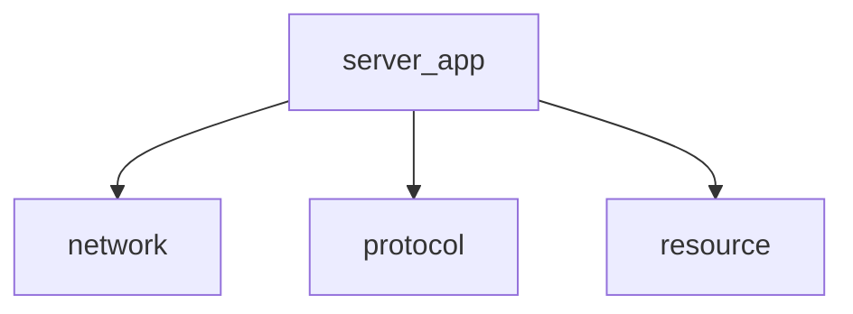

# HTTP specs-example 汇总（基于 specs-example/http_specs）

> 说明：本文件从 JSON specs 汇总生成；只抽取 specs 中真实出现的模块、类型、函数与依赖信息，不额外臆造。

## 协议元信息（PROTOCOL_MODULE_SPEC）
- 协议：HTTP/1.1 server subset
- 角色：SERVER
- 默认端口：8080
- Scope：HTTP/1.1 server subset (GET/HEAD/POST); external HTTP clients are used for validation.

## 规格清单统计
- JSON 文件总数：71
- KIND 统计：FILE_SPEC=8, FUNCTION_SPEC=62, PROTOCOL_MODULE_SPEC=1

## 生成顺序（GENERATION_ORDER）
- network → protocol → resource → server_app

## 一致性规则与禁止符号
### CONSISTENCY_RULES
- C1: network 层不得解析 HTTP 语义（方法、头部、状态码）；它只负责字节缓冲与 socket 事件分发。
- C2: HTTP 请求解析与响应编码仅允许位于 protocol 模块；network/resource/server_app 必须通过 http_request_parse/http_response_send 使用协议能力。
- C3: 路径安全沙箱由 resource 模块的 http_resolve_path 统一执行；server_app 在服务文件前必须调用 http_resolve_path，不得自行拼接或规范化路径。
- C4: 每个请求-响应周期结束后必须关闭 TCP 连接（Connection: close）；不实现 keep-alive、pipelining 或持久连接复用。
- C5: 仅支持 GET、HEAD、POST 三种方法；任何其他方法（包括 PUT、DELETE、PATCH、OPTIONS 等）必须返回 501 Not Implemented。
- C6: 目录请求优先服务 index.html；仅当 index.html 不存在时才生成 HTML 目录列表。
- C7: POST 仅允许创建新文件；POST 到已存在的目录路径返回 405 Method Not Allowed；POST 正文超过 HTTP_MAX_BODY (16 MiB) 返回 413 Payload Too Large。
- C8: 只能使用 canonical header 中声明的 public types、fields、enum values 与 functions；不得臆造额外 HTTP surface。

### FORBIDDEN_SYMBOLS
- HTTP_METHOD_GET (ENUM): HTTP method enum 唯一公开命名是 HTTP_GET
- HTTP_METHOD_POST (ENUM): HTTP method enum 唯一公开命名是 HTTP_POST
- http_request_set_method (FUNC): 不存在 setter；method 由 http_request_parse 内部设置
- http_send_response (FUNC): 响应发送函数命名是 http_response_send
- http_get_mime (FUNC): MIME 查询函数命名是 http_mime_by_ext
- http_connection_pop (FUNC): 不存在通用 pop；必须使用 http_connection_pop_line 或 http_connection_pop_bytes

## 模块概览（MODULES）

### network
- 角色：TCP/epoll 网络层：accept + 事件循环；连接对象的读缓冲（支持按行/按字节提取）、写缓冲与关闭；通过回调把连接与数据事件上交给上层。不得解析 HTTP 语义。
- 依赖模块：（无）
- 产物（ARTIFACTS）：
  - CONST: HTTP_IO_READABLE — epoll 可读事件标志位（值为 1）
  - CONST: HTTP_IO_WRITABLE — epoll 可写事件标志位（值为 2）
  - TYPE: http_connection_t — 连接对象不透明句柄，封装 fd、输入缓冲（支持行/字节提取）、输出缓冲与 flush 状态
  - TYPE: http_tcp_server_t — TCP server 不透明句柄，封装监听端口、epoll 句柄、运行标志与客户端连接链表
  - TYPE: http_tcp_callbacks_t — TCP server 回调集合结构，包含 on_accept、on_event、on_close 三个事件回调
  - FUNC: http_connection_create — 为已建立的 socket fd 创建连接对象并初始化缓冲区状态
  - FUNC: http_connection_destroy — 销毁连接对象并释放输入/输出缓冲区
  - FUNC: http_connection_read — 非阻塞循环 recv 读取 socket 数据追加到输入缓冲
  - FUNC: http_connection_pop_line — 从输入缓冲提取一行（以 \\n 分隔，去除 \\r）
  - FUNC: http_connection_pop_bytes — 从输入缓冲提取指定长度字节
  - FUNC: http_connection_buffered — 返回输入缓冲中当前可读字节数
  - FUNC: http_connection_queue — 将原始字节追加到输出缓冲队列
  - FUNC: http_connection_queue_str — 将 C 字符串追加到输出缓冲队列
  - FUNC: http_connection_flush — 非阻塞地将输出缓冲刷写到 socket
  - FUNC: http_connection_has_pending — 判断连接是否存在待发送数据
  - FUNC: http_tcp_server_create — 分配 TCP server 对象
  - FUNC: http_tcp_server_destroy — 关闭所有客户端连接、监听 fd 与 epoll fd，释放 server
  - FUNC: http_tcp_server_start — 创建非阻塞监听 socket、bind 端口、创建 epoll 实例
  - FUNC: http_tcp_server_stop — 置 running=false 通知事件循环退出
  - FUNC: http_tcp_server_run — 运行 epoll 事件循环
  - FUNC: http_tcp_server_update_interest — 更新 fd 的 epoll 监听事件
  - FUNC: http_tcp_server_close_client — 从 epoll 移除 fd、关闭 socket、触发 on_close 回调
- 关联源码文件（FILES）：
  - ../network/connection.h
  - ../network/connection.c
  - ../network/tcp_server.h
  - ../network/tcp_server.c

### protocol
- 角色：HTTP/1.1 请求解析与响应编码：将字节流解析为结构化请求（方法/URI/头部/正文），将响应状态/头部/正文编码为字节序列。不得依赖 socket/epoll 或文件系统。
- 依赖模块：（无）
- 产物（ARTIFACTS）：
  - TYPE: http_method_t — HTTP 请求方法枚举：GET/HEAD/POST/UNKNOWN
  - CONST: HTTP_MAX_HEADERS — 请求最大头部数量 64
  - CONST: HTTP_MAX_URI — 请求 URI 最大长度 2048 字节
  - CONST: HTTP_MAX_HEADER_NAME — 请求头部名称最大长度 256 字节
  - CONST: HTTP_MAX_HEADER_VALUE — 请求头部值最大长度 4096 字节
  - CONST: HTTP_MAX_BODY — 请求正文最大长度 16 MiB
  - TYPE: http_header_t — HTTP 头部键值对结构，包含 name[256] 和 value[4096]
  - TYPE: http_request_t — HTTP 请求结构：method、uri[2048]、headers[64]、header_count、动态 body 指针与 body_len
  - FUNC: http_request_init — 将 request 结构体 memset 清零
  - FUNC: http_request_free — 释放 request 的 body 动态内存并复位
  - FUNC: http_request_parse — 从连接输入缓冲解析 HTTP/1.1 请求行、头部与正文；返回 0/1/-1
  - FUNC: http_request_header — 按名称（大小写不敏感）查找请求头部值
  - FUNC: http_status_text — 将 HTTP 状态码映射为 RFC 标准状态文本
  - FUNC: http_response_send — 构建完整 HTTP/1.1 响应：状态行→Date→Server→Content-Length→Connection:close→正文
  - FUNC: http_response_send_html — 将 printf 风格格式化字符串包装为 text/html 响应并发送
- 关联源码文件（FILES）：
  - ../protocol/http_request.h
  - ../protocol/http_request.c
  - ../protocol/http_response.h
  - ../protocol/http_response.c

### resource
- 角色：文件系统抽象层：路径安全解析与沙箱（防目录遍历）、MIME 类型映射、文件读取、目录 HTML 列表生成。不得依赖 socket/epoll 或 HTTP 协议解析。
- 依赖模块：（无）
- 产物（ARTIFACTS）：
  - FUNC: http_mime_by_ext — 根据文件路径扩展名返回 MIME 类型字符串
  - FUNC: http_resolve_path — 将 root_dir + uri_path 规范化为绝对路径，检测并拒绝目录遍历攻击
  - FUNC: http_stat_path — 对路径执行 stat，返回文件类型
  - FUNC: http_read_file — 以二进制方式读取整个文件到动态分配的缓冲区
  - FUNC: http_dir_listing_html — 生成目录的 HTML 列表页面
- 关联源码文件（FILES）：
  - ../resource/file_ops.h
  - ../resource/file_ops.c

### server_app
- 角色：HTTP server 入口与请求处理协调：管理会话生命周期、将解析后的请求按方法分派到 GET/HEAD/POST 处理器、协调文件服务与错误响应。
- 依赖模块：network, protocol, resource
- 产物（ARTIFACTS）：
  - TYPE: http_session_t — 会话结构，关联 fd 与 http_connection_t 连接对象
  - TYPE: http_server_t — HTTP server 进程级对象的不透明句柄
  - FUNC: http_session_create — 为已 accept 的 fd 创建会话对象与底层连接对象
  - FUNC: http_session_destroy — 销毁底层连接对象并释放会话
  - FUNC: http_server_create — 创建 HTTP server：解析 root 目录、创建 TCP server 并绑定回调
  - FUNC: http_server_destroy — 销毁所有活跃会话、停止并销毁 TCP server
  - FUNC: http_server_start — 启动底层 TCP server
  - FUNC: http_server_run — 进入 TCP server 事件循环
  - FUNC: http_server_stop — 停止底层 TCP server 事件循环
  - FUNC: main — 进程入口：解析端口参数并启动 server
- 关联源码文件（FILES）：
  - ../main.c
  - ../server/http_server.h
  - ../server/http_server.c
  - ../server/http_session.h
  - ../server/http_session.c

## 模块依赖关系图



## 典型调用链

### 服务 GET 请求
```
main → http_server_create → http_server_start → http_server_run
  → on_accept_cb → http_session_create → add_session
  → on_event_cb (EPOLLIN) → http_connection_read → http_request_parse
    → dispatch → handle_get → serve_file
      → http_resolve_path → http_stat_path → http_read_file
      → http_mime_by_ext → http_response_send → http_connection_queue_str/queue
  → flush_and_update → http_connection_flush → close_client
```

### 服务 POST 请求
```
main → ... → on_event_cb (EPOLLIN) → http_connection_read → http_request_parse
  → dispatch → handle_post
    → http_resolve_path → stat → fopen/fwrite/fclose
    → http_response_send (201 Created) → flush_and_update → close_client
```

### 服务目录列表
```
main → ... → on_event_cb → dispatch → handle_get → serve_file
  → http_resolve_path → http_stat_path (返回目录)
  → stat(index.html) 不存在 → http_dir_listing_html
  → http_response_send → flush_and_update → close_client
```

## 测试向量（来自 README.md）

| 测试 | 方法 | 路径 | 预期状态码 | 关键 Trace |
|------|------|------|-----------|-----------|
| GET root index | GET | / | 200 | handle_get→serve_file→http_resolve_path |
| GET text file | GET | /hello.txt | 200 | handle_get→http_read_file→http_mime_by_ext |
| HEAD no body | HEAD | /hello.txt | 200 | handle_head→serve_file(head_only=true) |
| 404 Not Found | GET | /nonexistent.html | 404 | serve_file→http_stat_path |
| POST create file | POST | /newfile.txt | 201 | handle_post→http_resolve_path→fwrite |
| POST verify | GET | /newfile.txt | 200 | handle_get→http_read_file |
| Directory listing | GET | /subdir/ | 200 | serve_file→http_dir_listing_html |
| Path traversal | GET | /../etc/passwd | 403 | http_resolve_path→EACCES |
| POST to dir | POST | /subdir/ | 405 | handle_post→stat→S_ISDIR |
| Unknown method | DELETE | /hello.txt | 501 | dispatch→send_error |
